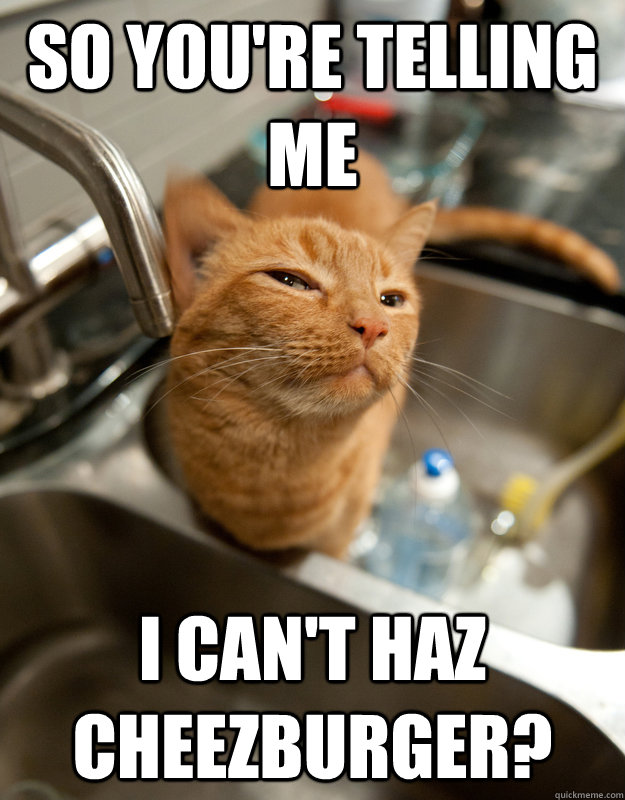
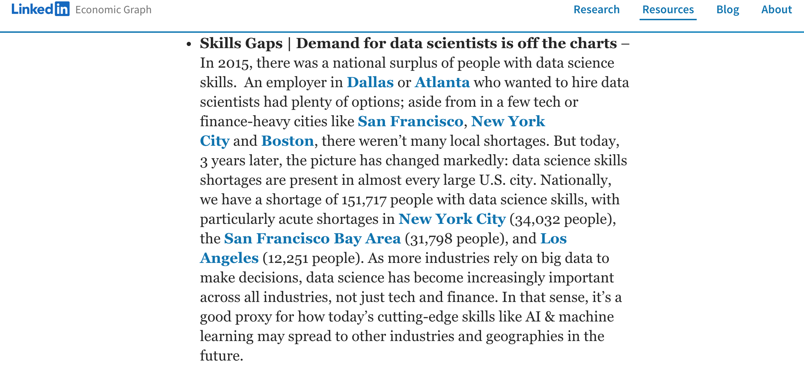
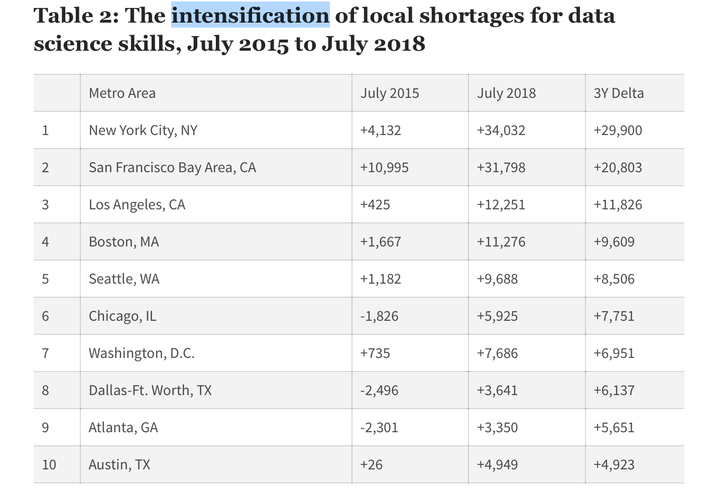

class: animated, bounceInDown
class: header_background
#What it is, data science ?


> In God we trust, all others bring data
>
>                             Wiliam E. Deming ?
> We are drowning in information and starving for knowledge
>
>                             Rutherford D. Roger
>Big data is like [redacted]: everyone talks about it, nobody really knows how to do it, 
> everyone thinks everyone else is doing it, so everyone claims they are doing it...
>
>                             Dan Ariely

---
class: clear, middle
  
```{r out.width = "950%", echo = FALSE}
knitr::include_graphics("figures/sexiest.png")
```
---
class: header_background
# The rise of data?
```{r out.width = "35%", echo = FALSE}

```

---
class: header_background
# But not all data are useful!
.pull-left[
```{r out.width = "55%", echo = FALSE}
knitr::include_graphics("figures/cheezeburger.jpg")
knitr::include_graphics("figures/cheezeburger2.jpg")
```
]

.pull-right[
```{r out.width = "55%", echo = FALSE}


```
]
---
class: header_background
# Shortage of data scientists
```{r echo = FALSE, out.width="70%", fig.cap = "Linkedin economic report"}

```

```{r echo = FALSE, out.width="70%", fig.cap = "IBM"}
knitr::include_graphics("figures/ibm.png")
```
---
class: clear, middle
```{r echo = FALSE, out.width = "60%", fig.cap = "PWC"}
knitr::include_graphics("https://www.pwc.com/us/en/publications/data-science-and-analytics/253879-2017-dsa-graphic-12-8b-07.png")
```

--
Who are these pesky data engineers ?

---
class: clear, middle
```{r echo = FALSE, out.width="70%", fig.cap = "Linkedin economic report"}

```
---
class: middle
class: header_background
# Data Science is right here.


```{r echo = FALSE, out.width="90%", fig.cap="https://research.ncsu.edu/dsi/"}
knitr::include_graphics("figures/ncsu_dsi.png")
```
---
class: header_background
# A lot of requirements ?
```{r out.width = "60%", echo = FALSE, fig.cap = "http://www.kimberlycoffey.com/blog/2016/11/text-analysis"}
knitr::include_graphics("https://bit.ly/2Mmu7lW")
```

---
class: header_background
# Many Venns of data science

.pull-left[
<br>
<br>
```{r out.width = "90%", echo = FALSE, fig.cap = "Figure from D. Conway"}
knitr::include_graphics("https://bit.ly/2NbBfBb")
```
]

.pull-right[
```{r out.width = "50%", echo = FALSE}
knitr::include_graphics("https://www.cognilytica.com/wp-content/uploads/2018/06/DATA-SCIENCE-VS-DATA-ENGINEER-CGIG001-v2.png")
```
]

---
class: clear
```{r out.width="70%", echo = FALSE}
knitr::include_graphics("figures/venn2.png")
```

---
class: header_background
# DS = Jack of all trades ?

> A human being should be able to change a diaper, plan an invasion, butcher a hog, conn a 
> ship, design a building, write a sonnet, balance accounts, build a wall, set a bone, 
> comfort the dying, take orders, give orders, cooperate, act alone, solve equations, 
> analyze a new problem, pitch manure, program a computer, cook a tasty meal, 
> fight efficiently, die gallantly. Specialization is for insects.
>
>                                         Robert A. Heinlein

---
class: header_background
# A Theorem A Theorem ... 

.bg-washed-blue.b--dark-blue.ba.bw2.br3.shadow-5.ph4.mt5[
**Theorem** Let $A$ be a positive definite matrix. Then there exists orthogonal matrix $U$ and diagonal matrix $D$ with $D$ having all positive diagonal entries such that
$$A = U D U^{\top}$$
Furthermore, for any function $f \colon \mathbb{R}^{+} \mapsto \mathbb{R}$, we have
$$f(A) = U f(D) U^{\top}$$
]


---
class: header_background
# John Tukey's FDA
```{r out.width="70%", echo = FALSE}
knitr::include_graphics("figures/tukey1.png")
knitr::include_graphics("figures/tukey2.png")
```
---
class: middle

```{r out.width = "70%", echo = FALSE}

```
---
class: header_background
# 50 Years of Data Science
```{r out.width="70%", echo = FALSE} 
knitr::include_graphics("figures/donoho.png")
```
 
A pdf of the article is provided [here](https://courses.csail.mit.edu/18.337/2015/docs/50YearsDataScience.pdf). 
 

---
class: header_background
#R ? Aarghhh!
> R is a language and environment for statistical computing and graphics. 
> It is a GNU project ...
> R provides a wide variety of statistical (linear and nonlinear modelling,
> classical statistical tests, time-series analysis, classification, clustering, …) 
> and graphical techniques, and is highly extensible. 
>
> https://www.r-project.org/about.html


--
### Q: Why R?

--
### A: Why not R?

---
class: header_background
# The R environment
R is an integrated suite of software facilities for data manipulation, calculation and graphical display. It includes
+ an effective data handling and storage facility,
+ a suite of operators for calculations on arrays, in particular matrices,
+ a large, coherent, integrated collection of intermediate tools for data analysis,
+ graphical facilities for data analysis and display either on-screen or on hardcopy, and
+ a well-developed, simple and effective programming language which includes conditionals, loops, user-defined recursive functions and input and output facilities.

The term "environment" is intended to characterize it as a fully planned and coherent system, rather than an incremental accretion of very specific and inflexible tools, as is frequently the case with other data analysis software. R can be extended (easily) via packages. 
There are about eight packages supplied with the R distribution and many more (>10,000) 
are available through the CRAN family of Internet sites.
---
class: header_background
# Resources for learning R

+ R-project [An Introduction to R](https://cran.r-project.org/doc/manuals/r-release/R-intro.pdf)

+ Roger Peng's [R Programming for Data Science](https://bookdown.org/rdpeng/rprogdatascience/)

+ Chapter $1$ through $4$ of Rafael Irizarry's [Introduction to Data Science](https://rafalab.github.io/dsbook/)

+ [JHU Coursera](https://www.coursera.org/learn/r-programming)

--
+ `?` in **R**
<br>

--
<br>
+ [Google it!](https://lmgtfy.com/?q=advanced+google+search+tips)

--
<br><br>
+ [Ask Miao Yu, your TA](https://statistics.sciences.ncsu.edu/people/myu12/); Office hours: 12:30--2:30pm, Tuesday.

--
<br><br>
+ [Least helpful](https://minh-tang.github.io)

---

class: clear
The previous Venn diagram was generated using the following code taken from a [Stack Exchange discussion](https://datascience.stackexchange.com/questions/2403/data-science-without-knowledge-of-a-specific-topic-is-it-worth-pursuing-as-a-ca).
```{r venn_diagram_code, tidy = FALSE, eval = FALSE}
draw.ellipse <- function(center,angle,semimajor,semiminor,
                         radius, h,s,v,...) {
  shape <- rbind(c(cos(angle),-sin(angle)),c(sin(angle),cos(angle))) %*% 
    diag(c(semimajor,semiminor))
  tt <- seq(0,2*pi,length.out=1000)
  foo <- matrix(center,nrow=2,ncol=length(tt),byrow=FALSE)+
         shape%*%(radius*rbind(cos(tt),sin(tt)))
  polygon(foo[1,],foo[2,],col=hsv(h,s,v,alpha=.5),
          border="black",...)
}
name <- function(x,y,label,cex=1.2,...) text(x,y,label,cex=cex,...)

png("~/Venn.png",width=800,height=600)
    opar <- par(mai=c(0,0,0,0),lwd=3,font=2)
        plot(c(0,100),c(0,90),type="n",bty="n",
             xaxt="n",yaxt="n",xlab="",ylab="")
        draw.ellipse(center=c(30,30),angle=0.75*pi, semimajor=2,
                     semiminor=1,radius=20,h=60/360,s=.068,v=.976)
        draw.ellipse(center=c(70,30),angle=0.25*pi,semimajor=2,
                     semiminor=1,radius=20,h=83/360,s=.482,v=.894)
        draw.ellipse(center=c(48,40),angle=0.7*pi,semimajor=2,
                     semiminor=1,radius=20,h=174/360,s=.397,v=.8)
        draw.ellipse(center=c(52,40),angle=0.3*pi,semimajor=2,
                     semiminor=1,radius=20,h=200/360,s=.774,v=.745)
```
---
class: clear
```{r eval = FALSE}
        name(50,90,"The Data Scientist Venn Diagram",pos=1,cex=2)
        name(8,62,"Communi-\ncation",cex=1.5,pos=3)
        name(30,78,"Statistics",cex=1.5)
        name(70,78,"Programming",cex=1.5)
        name(92,62,"Business",cex=1.5,pos=3)

        name(10,45,"Hot\nAir")
        name(90,45,"The\nAccountant")
        name(33,65,"The\nData\nNerd")
        name(67,65,"The\nHacker")
        name(27,50,"The\nStats\nProf")
        name(73,50,"The\nIT\nGuy")
        name(50,55,"R\nCore\nTeam")
        name(38,38,"The\nGood\nConsultant")
        name(62,38,"Drew\nConway's\nData\nScientist")
        name(50,24,"The\nperfect\nData\nScientist!")
        name(31,18,"Comp\nSci\nProf")
        name(69,18,"The\nNumber\nCruncher")
        name(42,11,"Head\nof IT")
        name(58,11,"Ana-\nlyst")
        name(50,5,"The\nSalesperson")
    par(opar)
dev.off()
```
---
class: header_background
#Course overview
```{r out.width="70%", echo = FALSE, fig.cap = "https://r4ds.had.co.nz"}
knitr::include_graphics("https://bit.ly/2CV35vJ")
```

We will cover the following topics
+ Data wrangling and tidying with dplyr and tidyr (**R** libraries)
+ Data visualization with ggplot2 (**R** library)
+ Hitch-hiker guide to SQL.
+ Linear regression and scatterplot smoothing. 
+ Classification, $k$-NN, linear/quadratic discriminant analysis, logistic regression.
+ Decision trees, support vectors machine.
+ Principal components analysis, multidimensional scaling, clustering.

---
class: clear
### Suggested Texts
+ Garrett Grolemund and Hadley Wickham, [R for Data Science](https://r4ds.had.co.nz)
+ Gareth James, Daniella Witten, Trevor Hastie, and Rob Tibshirani, [An Introduction to Statistical Learning with R](http://faculty.marshall.usc.edu/gareth-james/ISL/ISLR%20Seventh%20Printing.pdf)
+ Benjamin Baumer, Daniel Kaplan, and Nicholas Horton, [Modern Data Science with R](https://beanumber.github.io/mdsr2e/)

### Course Expectations & Grading
The grading is broken down into three components
   + homework assignments (40% of total grade)
   + two take-home exams (30% of total grade)
   + final project (30% of total grade)
   
The homework assignments, their due dates, and submission format 
will be posted on the Moodle page for the course. 
---
class: clear

### Homework policy
The class has, with high probability, 7 homework assignments. 
Late homework submissions will be penalized. In particular
+ Less than 24 hours late: 10% penalty towards total points.
+ Between 24 hours and 48 hours late: 20% penalty towards total points
+ Between 48 hours and 72 hours late: 40% penalty towards total points
+ More than 72 hours late: Not graded.	

### Term paper
For the final project, the students will work either individually or in a team of no more than three members. Each individual or group will complete a data analysis and write a short report (10 pages or less) summarizing the work. The report should provide a clear description of the dataset, the scientific questions of interest, the technical approach used to address or answer these questions, and state what conclusions, if any, can be derived from the analysis.
---
class: clear
### Choice of programming language
This class will require the use of **R**. Apologies in advance if you prefer other languages. The main rationale for using **R** is that (1) it is what the course instructor is most familiar with, (2) there is a large enough ecosystem for doing data science in **R** and (3) there is not enough time to discuss more than one languages/ecosystem.

### Grading disputes
Your assignment and exams score will be entered and stored on the Moodle page. 
You are responsible for keeping track of your scores and to notify the course instructor should there be any missing grades or discrepancies. Your exams will be returned to you after they had been graded. Please keep all returned exams. Grading dispute for an assignment will be considered only if the dispute is initiated within one week of the grade being entered. Grading dispute for an exam should be made within 72 hours of the exam being returned. A grading dispute might entail a regrading of the whole submission.

---
class: clear
### Key Dates
+ Census day & drop deadline: Friday, August 27, 2021.
+ Withdrawal deadline: Wednesday, October 13, 2021.
+ Midterm Exam 1: Monday, October 4, 2021 (take home)
+ Midterm Exam 2: Wednesday, November 10, 2021. (take home)
+ Term paper: Due on Monday, December 6, 2021 before 11:59pm (tentative)

### Grading scale
Grading is rounded to the nearest percentage point. Potential (upward) curving of the grades might also be done at the instructor discretion. Guaranteed letter grades, regardless of curving, are as follows, 

.pull-left[
+ 95% and above: A+
+ 90% — 94%: A 
+ 87% — 89%: A-
+ 83% — 86%: B+
+ 80% — 82%: B
+ 77% — 79%: B-
]

.pull-right[
+ 73% — 76%: C+
+ 70% — 72%: C
+ 65% — 69%: C-
+ 60% — 64%: D+
+ 50% — 59%: D
+ 50 % or below: F
]
---
class: clear

###Students with Disabilities
Reasonable accommodations will be made for students with verifiable disabilities. In order to take advantage of available accommodations, students must register with the Disability Resource Office at Holmes Hall, Suite 304, Campus Box 7509, 919-515-7653. For more information on NC State’s policy on working with students with disabilities, please see the [Academic Accommodations for Students with Disabilities](https://policies.ncsu.edu/regulation/reg-02-20-01/)

###Ethics
The strength of the university depends on academic and personal integrity. In this course, you must be honest and truthful. Students are permitted and indeed encouraged to discuss lecture materials and homework problems with one another, but it is expected that the writing up of answers will be done privately. Copying by one student of another student's homework solutions is considered an ethics violation in this course. Specifically, please do not share code or output; please do not access or use solutions from any source  before your homework assignment is submitted.
More information about university misconduct policies are available at
+ [Code of student conduct](http://policies.ncsu.edu/policy/pol-11-35-01)
+ [Academic honesty](http://policies.ncsu.edu/policy/pol-11-35-01)
