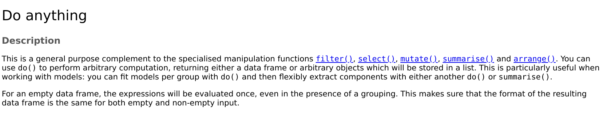

We follow an abbreviated presentation from Chapter 5 of [R for data science](https://r4ds.had.co.nz/). 

We first load the *flights13* dataset from the **nycflights13** package. This dataset describe the on-time data for all flights departing from NYC airports (i.e. JFK, LGA or EWA) in 2013.

```{r warning=FALSE, message = FALSE}
library(dplyr)
library(nycflights13)
data(flights)
flights
```
---
#filter()
Let us find flights departing NYC on August 21. Note that **dplyr** verbs takes a data frame and returns a new data frame.
```{r}
filter(flights, month == 8, day == 21)
## Equivalently: filter(flights, month == 8 & day == 21)
```
---
class: clear
Next, let us try to filter flights from August 21, 2013 that departs from either JFK or LGA.
```{r}
august21 <- filter(flights, month == 8 & day == 21)
filter(august21, origin == 'JFK' | origin == 'LGA') 
## Equivalently: filter(august21, origin %in% c("JFK","LGA"))
```
---
class: clear
Let us now check, among all the flights on August 21 from either JFK or LGA, which of them has a departure or arrival delay of 10 minutes or more.
```{r}
august21_jfk_lga <- filter(august21, origin %in% c("JFK","LGA"))
filter(august21_jfk_lga, arr_delay > 10 | dep_delay > 10)
```
---
class: clear
We can do all of the above filtering using a single chain sequence as follows
```{r}
flights |> filter(month == 8 & day == 21) |>
            filter(origin %in% c("JFK","LGA")) |>
            filter(arr_delay > 10 | dep_delay > 10)
```

+ The previous example introduce the `|>` pipe operator. 

+ The pipe operator allows us to chain together operations without the need to introduce auxiliary variables.

+ The pipe operator maps `x |> f(y)` to `f(x,y)`.

---
#Missing values
Missing values are represented in **R** as $\mathrm{NA}$; missing values are "contagious" hence any almost all operations involving one or more $\mathrm{NA}$ will also return a $\mathrm{NA}$. For example
```{r}
NA > 5
10 == NA
NA + 10
2*NA
```
---
class: clear
Further examples include
```{r}
NA == NA
0*NA
NA^0
NA | TRUE
FALSE & NA
```
---
class: clear
**filter** only includes rows where the condition is $\mathrm{TRUE}$, i.e., it excludes rows with both $\mathrm{FALSE}$ and $\mathrm{NA}$ values. To preserve missing values, we have to ask for them explicitly, e.g.,
```{r}
df <- tibble(x = c(1, NA, 3))
filter(df, x > 1)
filter(df, is.na(x) | x > 1)
```
---
#arrange()
The *arrange* verb is similar to the *filter* verb, but instead of selecting rows, it reorder them according to some set of column names (or more complicated expressions). As an example, let us order the flights first by the three letter code for the airport destination, then by the date of flight.
```{r}
flights_dest <- select(flights, dest, everything()) 
arrange(flights_dest, dest, month, day)
```
---
class: clear
We can use **desc** to order a column in descending order, e.g.,
```{r}
arrange(flights_dest, desc(dest), month, day)
```
---
#select()
This verb is used to select a subset of columns (of variables). As an example, let us keep only the departure and arrival time of the flights.
```{r}
flights_sml <- select(flights, year, month, day, 
                      dep_time, sched_dep_time, 
                      arr_time, sched_arr_time)
flights_sml
```
---
class: clear
There are a few equivalent way to do the above selection, e.g.,
```{r}
names(flights)
## flights_sml <- select(flights, year:day, dep_time, 
##                       sched_dep_time, arr_time, sched_arr_time)
## flights_sml <- select(flights, year:day, contains("dep_time"),
##                       contains("arr_time"))
## flights_sml <- select(flights, year:day, contains("time"),
##                      -c(air_time,time_hour))
```
---
class: clear
We can also rename variables using *select*; however this will lead to the dropping of variables that are not explicitly mentioned. A better alternative is to use *rename*, e.g.,
```{r}
rename(flights_sml,
       departure_time = dep_time, arrival_time = arr_time)
```
---
class: clear
A useful helper function for use with select is the **everything()** function, which matches all variables. For example, to move a specific variable to the first column of data frame, we can do
```{r}
select(flights_sml, dep_time, everything())
```
---
# mutate()
The *mutate* verb is used to add new columns (that are possibly functions of existing columns) to a data frame; the new columns are always added as the last columns. For example
```{r}
flights_sml <- select(flights, year:day,ends_with("delay"),
                      distance, air_time)
mutate(flights_sml, gain = arr_delay - dep_delay,
                    hours = air_time/60,
                    speed = distance/hours,
                    gain_per_hour = gain/hours) |> select(-hours)
```
---
class: clear
A variant of *mutate* is *transmute*, which drops all variables except the newly created variables, e.g.,
```{r}
transmute(flights, gain = arr_delay - dep_delay, 
                   hours = air_time/60, 
                   gain_per_hour = gain/hours)
```
---
#summarize()
The *summarize* verb collapses a data frame to a single row. For example
```{r}
summarize(flights, delay = mean(dep_delay)) ## oops! missing values
summarize(flights, delay = mean(dep_delay, na.rm = TRUE))
```
---
class: clear
This is not terribly exciting. The power of *summarize* comes from its combination with **groub_by()**, allowing us to do *grouped summaries*, i.e., summary statistics on individual groups. For example
```{r}
flights |> group_by(year, month, day)
```
---
class: clear
```{r}
flights |> group_by(year, month, day) |>
summarize(delay = mean(dep_delay, na.rm = TRUE))
```
---
class: clear
A more involved example is to compute the average distance and delay for flights to all destinations (except Honolulu).
```{r}
delays <- flights |> group_by(dest) |> 
  summarize(count = n(), 
            dist = mean(distance,na.rm = TRUE),
            avg_delay = mean(arr_delay + dep_delay,na.rm = TRUE)
            ) |>
  filter(count > 20, dest != "HNL")
delays
```
---
class: clear
We can then plot how the average delay varies with the distance.
```{r message = FALSE, fig.align = 'center', out.width='80%'}
library(ggplot2)
ggplot(delays, aes(x = dist, y  = avg_delay)) + 
  geom_point(aes(size = count)) +
  geom_smooth(se = FALSE) + ylab("average delay") + theme_bw()
```
---
class: clear
There are a large number of useful summary functions. See Section 5.6.4 of [R4DS](https://r4ds.had.co.nz/transform.html#summarise-funs). We provide a few more examples.
```{r}
## average arrival delay
not_canceled <- filter(flights, !is.na(dep_delay) & !is.na(arr_delay))
not_canceled |> group_by(year, month, day) |> 
  summarize(avg_delay = mean(arr_delay), 
            avg_positive_delay = mean(arr_delay[arr_delay > 0]))
```
---
class: clear
```{r}
not_canceled |> group_by(dest) |> 
  summarize(dist_sd = sd(distance)) |> arrange(desc(dist_sd))
```
---
class: clear
We note that *summarize* drops all variables except possibly those used to group the data and those variables introduced by the summary statistics. Contrasts the following two approaches
```{r}
not_canceled |> group_by(year,month,day) |>
  summarize(first_dep = first(dep_time), last_dep = last(dep_time))
```
---
class: clear
```{r}
not_canceled |> group_by(year, month, day) |>
  mutate(r = min_rank(desc(dep_time))) |> filter(r %in% range(r))
```
---
# More examples
```{r}
not_canceled |> group_by(year, month, day) |>
  summarize(n_early = sum(dep_time < 500))
```
---
class: clear
```{r}
not_canceled |> group_by(dest) |>
  summarize(long_delay_pct = mean(arr_delay > 60)) |>
  arrange(desc(long_delay_pct))
```
---
class: clear
Finally, when you group by multiple variables, each call to $\mathrm{summary}$ peels off one level of the grouping, e.g.,
```{r}
daily <- group_by(flights, dest, month, day)
daily
```
---
class:clear
```{r}
daily |> summarize(flights = n()) |> 
          summarize(flights = sum(flights)) |>
          summarize(flights = sum(flights)) 
```
---
class: clear
Be careful when peeling off nested groupings using a sequence of $\mathrm{summarize}$. 

Consider the following examples.

```{r echo = -1}
#options(tibble.print_max = 6, tibble.print_min = 4)
group_by(not_canceled, dest, month) |> 
  summarize(air_time = mean(air_time)) |> 
  summarize(air_time = mean(air_time))
```
---
class: clear
```{r}
group_by(not_canceled, dest) |> 
  summarize(air_time = mean(air_time))
```
---
class: clear
```{r}
group_by(not_canceled, dest, month) |> 
  summarize(air_time = median(air_time)) |> 
  summarize(air_time = median(air_time))
```
---
class: clear
```{r}
group_by(not_canceled, dest) |> 
  summarize(air_time = median(air_time))
```
---
#ungroup()
To remove grouping structure on grouped data, use $\mathrm{ungroup()}$, e.g.,
```{r}
daily <- group_by(flights, year, month, day)
summarize(daily, flights = n())
daily |> ungroup() |> summarize(flights = n())
```
---
#grouped mutate + filter
We can also do a number of very useful operations by combining $\mathrm{group\_by}$ with either $\mathrm{filter}$ or $\mathrm{filter}$. For example
```{r message = TRUE}
## Find the worst flights with longest delay each day
flights_sml <- select(flights, year:day, ends_with("delay"),
                      distance, air_time)
flights_sml |> group_by(year, month, day) |>
  filter(rank(desc(arr_delay)) <= 10)
```
---
```{r}
## Find all popular destinations and compute
## proportion of total delay for each flights
flights |> group_by(dest) |>
  filter(n() > 365, arr_delay > 0) |>
  mutate(prop_delay = arr_delay/sum(arr_delay)) |>
  select(year:day, dest, arr_delay, prop_delay)
```
---
Functions that work most naturally in grouped mutates and grouped filters are [window functions](https://rpubs.com/hadley/window) (see the **R** command $\mathrm{vignette("window-functions")}$. 

The following example is from [window functions](https://rpubs.com/hadley/window). The example uses a dataset from the **Lahman** database that contains pitching, hitting, and fielding statistics for MLB from $1871$ through $2018$. We will consider a sample of batting data for players that have won an award.
```{r}
library(Lahman)
batting <- Lahman::Batting |> as_tibble() |> 
           select(playerID, yearID, teamID, G, AB, R, H) |>
           arrange(playerID, yearID, teamID) |>
           semi_join(Lahman::AwardsPlayers, by = "playerID")
players <- batting |> group_by(playerID)
```
---
Using this dataset, let us try a few $\mathrm{group\_mutate}$ and $\mathrm{group\_filter}$ operations. 
```{r}
## For each player, find the two years with most hits
filter(players, min_rank(desc(H)) <= 2 & H > 0)
```
---
class: clear
```{r}
## For each player, rank each year by the number of games played
mutate(players, G_rank = min_rank(G))
```
---
class: clear
```{r}
## For each player, find every year that was 
## better than the previous year
filter(players, AB > 0, lag(AB) > 0, H/AB > lag(H)/lag(AB))
```
---
class: clear
```{r}
# For each, player compute a z score based on number of games played
mutate(players, G_z = (G - mean(G)) / sd(G))
```
---
class: clear
The $\mathrm{ntile(x,m)}$ function divides the (numeric) vector $x$ into $m$ evenly sized buckets. The next operation divides the team players into $4$ coarse groups and calculate the batting average for each group.
```{r}
batting |> group_by(teamID,playerID) |>
  summarise(total_hits = sum(H), total_ab = sum(AB), 
            batting_avg = total_hits/total_ab) |>
  filter(!is.na(batting_avg)) |>
  mutate(quartile = ntile(batting_avg,4)) |>
  group_by(teamID,quartile) |> 
  summarise(batting_avg = sum(total_hits)/sum(total_ab))
```

---
#across() and multiple columns
The **dplyr** verbs such as **mutate** and **summarize** we saw previously can also be combined with the [across](https://dplyr.tidyverse.org/reference/across.html) function to allow for doing the same operation on multiple columns. See also this [vignette](https://dplyr.tidyverse.org/articles/colwise.html).
.pull-left[
```{r}
df <- tibble(
  x = runif(100), 
  y = runif(100), z = runif(100))
df
```
]
.pull-right[
```{r}
df |> summarize(
  across(c(x,y,z),mean))
## Equivalently
## df |> summarize(
##   across(everything(),mean))
```
]

---
class: clear

With **across **you can also 
+ apply multiple operations 
+ name the return values
+ select a subset of columns according to some condition

```{r}
df <- df |> mutate(names = rep(letters,4)[1:100])
df
df |> summarize(across(where(is.numeric),
                        list(mean = mean, sd = sd, ratio = ~max(.)/min(.))))

```

---
class: clear

The previous examples uses the $.$ operator, which serves as a placeholder for the variable/data of interest. See also the documentation for the [magrittr library](https://github.com/tidyverse/magrittr). It is, however, generally cleaner (syntax wise), to define and use a named function as opposed to an anonymous function.

```{r}
max_min_ratio <- function(x){
  max(x)/min(x)
}
df |> summarize(across(where(is.numeric),
                        list(mean = mean, sd = sd, ratio = max_min_ratio)))

# You can also combine multiple selection criteria
df |> summarize(across(where(is.numeric) & c(-x),
                        list(mean = mean, sd = sd, ratio = max_min_ratio)))

## Equivalently
## df |> summarize(across(c(y,z), 
##     list(mean = mean, sd = sd, ratio = max_min_ratio)))
```

---
class: clear

The following example shows the power of combining **across** with **group_by** and **mutate**. See this [blog post](https://www.rebeccabarter.com/blog/2020-07-09-across/) by 
R. Barter for more details. 
```{r}
library(palmerpenguins)
penguins
## Let us first count the number of species, number of island 
## and number of different sexes of the penguins
penguins |> summarise(across(c(species, island, sex),n_distinct))

```

---
class: clear
```{r}
## Let us count the number of missing values in each columns
penguins |> summarise(across(everything(),~sum(is.na(.))))
```

---
class: clear
```{r penguins}
## Replace missing values for the numerical variables by the 
## average value (computed within that specie and island).
library(dplyr)
penguins_imputed <- penguins |>
  group_by(species, island) |>
  mutate(imputed = if_any(where(is.numeric), is.na),
         across(where(is.numeric), 
                ~if_else(condition = is.na(.), 
                         true = mean(., na.rm = T), 
                         false = as.numeric(.)))) |> ungroup() |> 
  select(imputed, everything())

penguins_imputed
penguins_imputed |> filter(imputed == TRUE)
```

---
class: clear

The **filter** verb does not work with **across**; we instead use the helpers [if_any](https://dplyr.tidyverse.org/reference/across.html) and [if_all](https://dplyr.tidyverse.org/reference/across.html).


```{r}
## Find all observations with at least one missing value
flights |> filter(if_any(everything(), is.na))
```

---
class: clear
```{r}
## Find all flights with little delay
flights |> filter(if_all(contains("delay"), ~ . < 10))
```

---
#dplyr::pull()
Finally, we discuss the use of the *pull* function to *extract* or *pull out* a variable/column from a data frame. Consider the following code.
```{r error = TRUE}
flights |> select(arr_delay)
class(flights |> select(arr_delay))
```
---
class: clear
```{r error = TRUE}
flights |> pull(arr_delay) |> head
class(flights |> pull(arr_delay))
```
--
If we now extract the standard deviation from the above data frame/vector, we get
```{r error = TRUE}
flights |> select(arr_delay) |> sd(na.rm = TRUE)
flights |> pull(arr_delay) |> sd(na.rm = TRUE)
```

The difference in the above output is due to the fact that $\mathrm{sd}$ expects a *numeric* vector. Meanwhile, the *select* verb takes as input a *data frame* and ouputs another *data frame*. Since we want to extract the column $\mathrm{arr\_delay}$ ,we need to use $\mathrm{pull}$. 
---
#summarise + rows vs columns
Continuing the above theme. Suppose we want to find the quantiles for $\mathrm{arr\_delay}$ as grouped by popular destination.
We first try the following code.
```{r error = TRUE}
pop_dest <- flights |> 
  group_by(dest) |> 
  filter(n() > 365,!is.na(arr_delay))
pop_dest |> summarise(delay_quantile = quantile(arr_delay))
```
---
class: clear

The code seems to give a vector of five numbers for each destination. However, in many cases, we prefer to have five new columns but only one row for each destination. Let us first simplify the problem and find the quantiles for 
$\mathrm{arr\_delay}$ for the **ungrouped** data.
```{r error = TRUE}
pop_dest |> ungroup() |> 
  summarise(delay_quantile = quantile(arr_delay))
quantile(pop_dest$arr_delay,na.rm = TRUE)
```
After some thought (googling?), we realize that **dplyr** verbs takes as input a data frame and outputs another data frame. The output of $\mathrm{quantile}$ is a vector not a data frame. Helper functions to the rescue.
---
class: clear

```{r error = TRUE}
library(tibble)
my_quantile <- function(x){
  z <- quantile(x,na.rm = TRUE)
  names(z) <- c("min","percentile25","median","percentile75","max")
  as_tibble_row(z)
}
pop_dest |> ungroup() |> summarise(my_quantile(arr_delay)) 
pop_dest |> summarise(my_quantile(arr_delay)) ### Yay!
```
---
class: clear, middle

Finally, compare the previous output with the following
```{r}
pop_dest |> 
  summarise(val = quantile(arr_delay), q = c(0, 0.25, 0.5, 0.75,1))

```


<!-- class: clear -->
<!-- Finally, we present examples of $\mathrm{filter\_if}$, $\mathrm{filter\_at}$ and $\mathrm{filter\_all}$. These verbs are often used in conjunction with $\mathrm{any\_vars}$ or $\mathrm{all\_vars}$. -->
<!-- ```{r} -->
<!-- ## Find all observations with at least one missing value. -->
<!-- flights |> filter_all(any_vars(is.na(.)))  -->
<!-- ``` -->
<!-- --- -->
<!-- class: clear -->
<!-- ```{r} -->
<!-- ## Find all flights with little delay -->
<!-- flights |> filter_at(vars(contains("delay")), all_vars(. < 10)) -->
<!-- ``` -->

<!-- --- -->
<!-- class: clear, middle -->
<!-- Let us now un-un-group the (grouped) data. -->
<!-- ```{r error = TRUE} -->
<!-- pop_dest |> my_quantile(variable = 'arr_delay') ### Oops! -->
<!-- ``` -->
<!-- Our helper function $\mathrm{my\_quantile}$ does not understand grouped vs ungrouped data. -->
<!-- Luckily, since we "Think and do", after some thinking (googling?) -->
<!-- --- -->
<!-- class: clear -->

<!-- ```{r error = TRUE} -->
<!-- pop_dest |>  -->
<!--   do(my_quantile(.,variable = 'arr_delay')) -->
<!-- ``` -->

<!-- -- -->
<!-- The help page for [dplyr::do](https://dplyr.tidyverse.org/reference/do.html) reads -->

<!-- ```{r out.width = "70%", echo = FALSE} -->
<!--  -->
<!-- ``` -->

<!-- See also section 5.12 of [Introduction to Data Science](https://rafalab.github.io/dsbook/tidyverse.html#do) -->