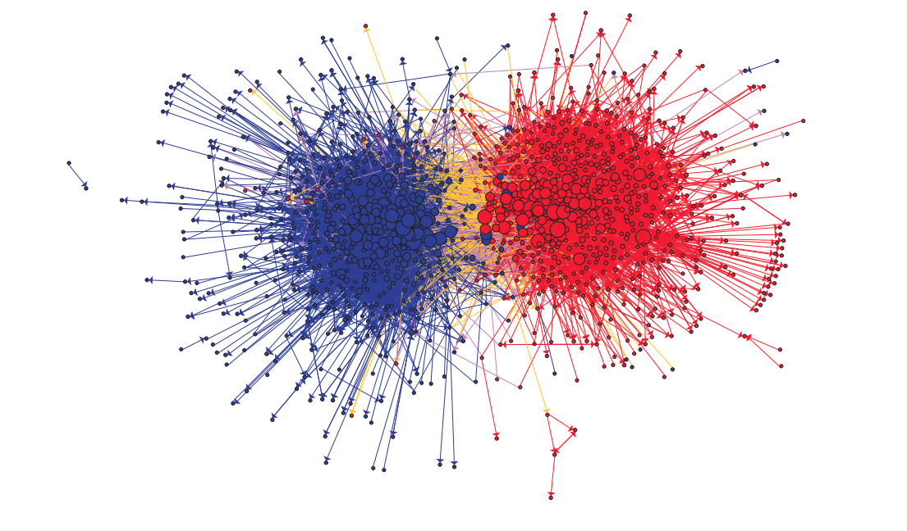

# Hierarchical clustering

The aim of hierarchical clustering is to build a tree or **dendogram** that organizes the relationships between observations. For example, consider the following [evolutionary tree of mammals](https://www.ncbi.nlm.nih.gov/pmc/articles/PMC3204295/).

```{r fig.caption = "From Graphodatsky et al.", echo = FALSE, out.width="70%"}
knitr::include_graphics("https://beanumber.github.io/mdsr2e/gfx/evolutionary-tree.jpeg")
```

---
class: clear
To illustrate hierarchical clustering in **R**, we will use the following [dataset](https://www.fueleconomy.gov/feg/epadata/16data.zip)
on the fuel economy rating of cars from the US Department of Energy. We follow the exposition in Chapter 9 of Baumer et al. [Modern Data Science with R](https://beanumber.github.io/mdsr2e/ch-learningII.html#clustering)

```{r fuel, cache = TRUE, message = FALSE}
library(dplyr)
library(readxl)
library(janitor) ## library for simple tools for cleaning data.
library(tibble)
filename <- "data/2016_feguide.xlsx"
cars <- read_excel(filename) %>% 
  janitor::clean_names() %>%
  rename(make = mfr_name, model = carline, displacement = eng_displ,
    city_mpg = city_fe_guide_conventional_fuel,
    hwy_mpg = hwy_fe_guide_conventional_fuel) %>%
  select(make, model, displacement, number_cyl, number_gears, city_mpg, hwy_mpg) %>%
  distinct(model, .keep_all = TRUE) %>% 
  filter(make == "Toyota") %>%
  column_to_rownames(var = "model")
```

---
class: clear
```{r}
head(cars)
```

Toyota has a diverse lineup of cars, trucks, SUV, and hybrid vehicles. Can we build a dendogram to cluster or categorize this vehicle lineup in a coherent manner ? 

---
class: clear

Given $n$ data points $\{X_i\}_{i=1}^{n}$ a reasonable approach to hierarichal clustering proceeds as follows.

+ Compute a notion of distance/dissimilarity between any two data points.
+ Starting from the bottom level, where each data point is a cluster, build up a 
tree by merging two clusters. At each step of the algorithm, the two clusters that are **most similar** are combined into a new or bigger cluster. 
+ The procedure is iterated until all points are member of one single cluster (the root).

---
class: clear

The choice of which cluster to merge is defined by the type of linkage methods. Some of the most popular ones are (given two clusters $\mathcal{C}_i$ and $\mathcal{C}_j$)

- Single (or minimum) linkage: similarity defined by the **minimum** (pairwise) distance between the elements in $\mathcal{C}_i$ and the elements in $\mathcal{C}_j$. Tends to produce "long" clusters.

- Complete (or maximum) linkage: similarity defined by the **maximum** (pairwise) distance between the elements in $\mathcal{C}_i$ and the elements in $\mathcal{C}_j$. Tends to produce "short" (or compact clusters)

- Mean/average linkage: similarity defined by the **average** (pairwise) distance between the elements in $\mathcal{C}_i$ and the elements in $\mathcal{C}_j$.

- Centroid linkage: similarity defined by the distance between the **centroid** of cluster $\mathcal{C}_i$ and the centroid of cluster $\mathcal{C}_j$.

- Ward's linkage: The similarity is defined by
$$\Delta(\mathcal{C}_i, \mathcal{C}_j) = \sum_{x \in \mathcal{C}_i \cup \mathcal{C}_j} d(x, m_{ij})^2 - \sum_{x \in \mathcal{C}_i} d(x, m_i)^2 - \sum_{x \in \mathcal{C}_j} d(x, m_j)^2$$
where $m_i$, $m_j$, and $m_{ij}$ are the centroid for $\mathcal{C}_i$, $\mathcal{C}_j$, and $\mathcal{C}_i \cup \mathcal{C}_j$.

---
class: clear

Hierarchical clustering in **R** can be done via [hclust](https://www.rdocumentation.org/packages/stats/versions/3.6.1/topics/hclust). **hclust** takes as input a distance/dissimmilarity matrix.

```{r}
## Scale all variables to have the same "unit"
cars_scaled <- scale(dplyr::select(cars, -make), center = TRUE, scale = TRUE)
toyota_dist <- dist(cars_scaled) 
as.matrix(toyota_dist)[1:5,1:5] ## Distance between the first five cars
```

---
class: clear
```{r}
cars_hclust <- hclust(toyota_dist, method = "complete") ## Complete linkage
str(cars_hclust)
```
---
class: clear
```{r}
plot(cars_hclust, cex = 0.6, hang = -1, xlab = "", sub = "", 
     main = "Hierarchical clustering of Toyota cars (complete linkage)")
```

--
Good luck reading these labels.

---
# Challenges in hierarchical clustering
There are several important issues in using hierarchical clustering. 

+ Choice of dissimilarity/distance metrices used in the hierarchical clustering. Even for the normal Euclidean distance, a small but possibly important question is whether or not to scale the variables in the data (to have sample variance 1). For data with discrete/nominal variables, might want to consider the [Gower distance](https://www.jstor.org/stable/2528823); see also the **R** package [cluster](https://www.rdocumentation.org/packages/cluster/versions/2.1.0) and the [daisy function](https://www.rdocumentation.org/packages/cluster/versions/2.1.0/topics/daisy)

+ Different linkage method will generally yield (substantially) different clustering. Unless there is additional or specific knowledge (e.g., domain knowledge), there is no way to determine which clustering is preferable.

+ Hierarchical clustering do not yield, a priori, a (hard) clustering of the data points into a fixed number of clusters. One heuristics is to truncate the dendogram at a fixed level and then using the clustering at that given level.

---
# K-means clustering

Another clustering technique is $K$-means clustering, which assign each data point $X_i$ to one of several distinct clusters, with the aim of minimizing the sum of square distance between each data point and its assigned cluster centroid. More specifically, given a positive integer $K \geq 1$ representing the number of clusters, $K$-means aim to solve the minimization problem

$$\min_{\mathcal{C}_1, \dots, \mathcal{C}_k} \sum_{k=1}^{K} \sum_{X_i \in \mathcal{C}_k} \|X_i - \hat{\mu}_k\|^2$$
where $\hat{\mu}_k = \frac{1}{|\mathcal{C}_k|} \sum_{X_i \in \mathcal{C}_k} X_i$ is the centroid of the $k$-th cluster. 

---
class: clear
When the data points $X_i \in \mathbb{R}^{d}$ for $d \geq 2$, the **globally** optimal solution to the $K$-means problem is, in general, computationally intractable. There are multiple algorithms for doing $K$-means, with the simplest algorithms being a variant of the following procedure.

1. Initialize $K$ random cluster centroids locations $\hat{\mu}_1, \hat{\mu}_2, \dots, \hat{\mu}_K$.
2. Assign each data point $X_i$ to the closest cluster centroid $\hat{\mu}_k$ for some $k$ (with ties broken arbitrarily)
3. Recompute $\hat{\mu}_k = \frac{1}{|\mathcal{C}_k|} \sum_{X_i \in \mathcal{C}_k} X_i$
4. Repeat steps $2$ and $3$ until convergence.

See [here](http://tech.nitoyon.com/en/blog/2013/11/07/k-means/) for a visualization of $K$-means.

+ The main decision in $K$-means is choosing $K$, the number of clusters. Once again, unless there is additional knowledge, there are almost no good way of choosing $K$.

+ The $K$-means algorithm in general will only find a local minimum (which depends on the initial random cluster centroids). There are several heuristics, such as random restarts, to remove this limitation

+ Given two values of $K$, say $K_1$ and $K_2$, we can compute a similarity index such as the [adjusted Rand Index](https://en.wikipedia.org/wiki/Rand_index) (from the **clues** or **mclust** package) between the two clusterings.

---
# K-means example 
```{r}
data(USArrests)
USArrests
```

---
class: clear
```{r}
fit <- kmeans(USArrests, centers = 5, iter.max = 50, nstart = 20)
str(fit)
head(fit$cluster)
```
---
class: clear

We see how scaling the data could impact the clustering.
```{r}
fit2 <- kmeans(scale(USArrests), centers = 5, iter.max = 50, nstart = 20)
library(mclust)
table(fit$cluster, fit2$cluster)
adjustedRandIndex(fit$cluster, fit2$cluster)
fit3 <- kmeans(USArrests, centers = 4, iter.max = 50, nstart = 20)
adjustedRandIndex(fit$cluster, fit3$cluster)
```

---
# Example: PCA/SVD and clustering
```{r}
## Voting records from the Scottish Parliement
## The data is part of the mdsr package accompanying the book
## Modern data science with R.
library(mdsr)
data(Votes) 
Votes
```
---
class: clear
A visualization of this voting records is as follows. We follow the presentation in Chapter 10 of Baumer et al. [Modern Data Science with R](https://beanumber.github.io/mdsr2e/ch-learningII.html#clustering)
```{r out.width = "70%", fig.align = 'center'}
Votes %>% 
  mutate(Vote = factor(vote, labels = c("Nay","Abstain","Aye"))) %>%
  ggplot(aes(x = bill, y = name, fill = Vote)) +
    geom_tile() + xlab("Ballot") + ylab("Member of Parliament") +
    scale_fill_manual(values = c("darkgray", "white", "goldenrod")) + 
    scale_x_discrete(breaks = NULL, labels = NULL) + 
    scale_y_discrete(breaks = NULL, labels = NULL)
```

---
class: clear
Suppose we want to cluster the members of the Scottish parliement based on their voting records. Our approach is to first converting the data to a wide format, then do SVD, and then clustering the data via e.g., $K$-means.

```{r}
Votes_wide <- Votes %>%
  tidyr::spread(key = bill, value = vote)
Votes_wide
vote_svd <- Votes_wide %>% 
  select(-name) %>% svd()
str(vote_svd)

```

---
class: clear
```{r fig.align = 'center', out.width="60%"}
## Scree plot
plot(vote_svd$d^2/sum(vote_svd$d^2), 
     xlab = "dimension", 
     ylab = "proportion of variability explained")
k <- 3
voters <- as.data.frame(vote_svd$u[,1:k] %*% diag(vote_svd$d[1:k]))
clusters <- kmeans(voters, centers = 7, nstart = 50,iter.max = 50)
```
---
class: clear
We now add the clustering information to the voters data along with the parties 
name of each parliement members.
```{r}
data(Parties)
Parties
voters <- voters %>% mutate(cluster = as.factor(clusters$cluster)) %>%
  mutate(name = Votes_wide$name) %>%
  left_join(Parties, by = c("name" = "name"))
```
---
class: clear
```{r}
voters
```

---
class: clear
We now compare our clustering against the party membership.
```{r}
table(voters$party, voters$cluster)
adjustedRandIndex(voters$cluster, voters$party)
```

---
# Alternatives to $K$-means clustering

Three important alternatives to $K$-means clustering are

+ $K$-medoids clustering. Given $n$ data points $\{X_i\}_{i=1}^{n}$ and a positive integer $K$, find $m_1, m_2, \dots, m_K \subset \{X_i\}$ to minimize
$$\sum_{i=1}^{n} \min_{k} d(X_i, m_k)$$
for some notion of distance $d$.
The restriction that the **medoids** $m_k \in \{X_i\}_{i=1}^{n}$, i.e., that the medoids are among the observed data points, allow for the $k$-medoids algorithm to converge even when $d$ is not necessarily the Euclidean distance. Furthermore, since $m_k \in \{X_i\}$, this avoids the issue of averaging say categorical variables and thus the $k$-medoids algorithm can be more easily applied to handle categorical/discrete data. See the package [pam](https://www.rdocumentation.org/packages/cluster/versions/2.1.0/topics/pam) in **R**.

---
class: clear

+ Gaussian mixture modeling. Assume that the $X_i$ can be modeled as a mixture of multivariate Gaussian. $K$-means can be viewed as a special case of Gaussian mixture modeling wherein all the multivariate Gaussians have covariance matrices identical to $\sigma^2 \mathbf{I}$ for some $\sigma^2 > 0$. There are two benefits to assuming Gaussian mixtures (1) allow for soft clustering of the data points and (2) can choose $K$, the number of clusters, via an information criterion such as BIC. See the package [mclust](https://www.rdocumentation.org/packages/mclust/versions/5.4.2/topics/Mclust) in **R**.

+ Spectral clusering: Combination of (non-linear) PCA and K-means. Given a matrix $\mathbf{X}$ of $n$ data points, compute a $n \times n$ affinity/kernel matrix $\mathbf{K}$. Do truncated PCA/SVD on $\mathbf{K}$ to yield a $n \times d$ matrix $\mathbf{Z}$ representing $n$ points in $\mathbb{R}^{d}$. Then run $K$-means (or some other clustering algorithm) on the rows of $\mathbf{Z}$. Simple enough that it should be implemented by hand, but see [specc](https://www.rdocumentation.org/packages/kernlab/versions/0.9-29/topics/specc) for an implementation.

---
#Example: Spectral clustering
```{r fig.asp = 1, fig.retina = 3, out.width = "45%"}
## libary for Machine learning benchmark problems
library(mlbench) 
set.seed(123)
obj <- mlbench.spirals(100,1,0.025)
df <-  4 * obj$x
plot(df, xlab = "", ylab = "")
```

---
class: clear
```{r fig.asp =1, out.width = "50%"}
library(kernlab)
cluster <- specc(df, centers = 2)
head(cluster)
plot(df, col = cluster, xlab = "", ylab = "")
```

---
#Example: Community detection
We now discuss how the idea of dimension reduction and clustering can be used to analyze and detect communities in networks. We will use the data from [Adamic \& Glance](https://dl.acm.org/citation.cfm?id=1134277)
```{r fig.cap = "Political blogs visualization from Adamic and Glance", out.width="70%", echo = FALSE}

```

---
class: clear
The raw data is available [here](https://raw.githubusercontent.com/jdwilson4/Network-Analysis-I/master/Data/polblogs.txt) as a list of edges. We will use the [igraph package](https://igraph.org/r/) to read in the data.
```{r cache = FALSE}
library(igraph)
blog_graph <- read_graph("https://raw.githubusercontent.com/jdwilson4/Network-Analysis-I/master/Data/polblogs.txt")
blog_graph
```

---
class: clear
```{r cache = TRUE, fig.asp = 1.2, out.width="60%"}
V(blog_graph)$color <- c(rep("red", 758), rep("blue", 732))
#color the labels according to political party
plot(blog_graph, main = "Political Blog Network", usearrows = TRUE)
```

---
class: clear
Well, the above visualization looks **terrible**. Sadly, proper visualization of this graph data is highly non-trivial. Let us try a different approach.
```{r cache = FALSE, out.width = "80%"}
blog_adj <- blog_graph[] ## Get adjacency matrix
dim(blog_adj)
image(blog_adj)
```

---
class: clear
If you squint enough hopefully you will see the black dots denoting the presence of an edge between two blogs in the previous figure.
Let us try doing a truncated SVD to find a representation for these blogs.
```{r cache = FALSE, echo = FALSE}
library(dplyr)
library(magrittr)
largest_strong_component <- function(graph) {
   co <- components(graph, mode = "strong")
   which.max(co$csize) %>%
   equals(co$membership) %>%
   induced_subgraph(graph = graph)
}
blog_graph <- largest_strong_component(blog_graph)
```

```{r out.width="80%"}
blog_adj <- blog_graph[] ## Get adjacency matrix
blog_svd <- svd(blog_adj)
## Scree plot
plot(blog_svd$d^2/sum(blog_svd$d^2), 
     ylab = "proportion of variability explained", xlab = "dimension")
```

---
class: clear
Let us now plot the truncated SVD representation in $\mathbb{R}^2$ for these blogs. The points are colored according to the ground truth (the political leaning of the blogs)
```{r fig.asp = 0.9,out.width="70%"}
plot(blog_svd$u[,1:2], col = V(blog_graph)$color, 
     xlab = "Dimension 1", ylab = "Dimension 2")
```

---
class: clear
Let us now see how well $K$-means clustering recover the ground truth. We first transform the data by "projecting onto the sphere".
```{r}
X <- blog_svd$u[,1:2]
X_norm <- sqrt(rowSums(X^2))
X_norm[X_norm == 0] <- 1
X_sphere <- X/X_norm ## normalize each row to have norm 1.
clusters <- kmeans(X_sphere, centers = 2, nstart = 50)
table(clusters$cluster, V(blog_graph)$color) ## clustering error rate of roughly 5%
```

Note that if we do not transform the embedding prior to $K$-means then we get
```{r}
clusters <- kmeans(X, centers = 2, nstart = 50)
table(clusters$cluster, V(blog_graph)$color) ## clustering error rate of roughly 31%
```