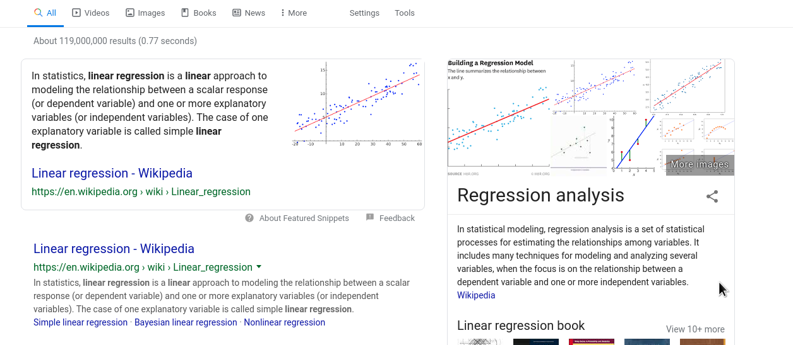

#Regression is everywhere
```{r echo = FALSE, out.width="80%", fig.cap= "120 millions hits on Google"}

```

---
class: clear
```{r echo = FALSE, out.width="70%", fig.cap= "750K articles on PubMed"}

```
---
class: clear
```{r echo = FALSE, warning = FALSE, fig.cap = "Even your exam scores exhibit regression to the mean"}
library(faraway)
library(ggplot2)
data(stat500)
stat500 <- data.frame(scale(stat500))
ggplot(data = stat500, aes(x = midterm, y = final)) +
  geom_point() +  geom_smooth(method = "lm", se = FALSE)
```

---
#Prelude to linear models: curve fitting

```{r message = FALSE, echo = FALSE, cache = FALSE}
set.seed(123)
library(ggplot2)
library(tidyverse)
df <- tibble(x = rnorm(20), y = exp(x) + 2*x^2 + rnorm(20, sd = 0.5))
p <- ggplot(df, aes(x = x, y = y)) + geom_point() + xlab("Foo") + ylab("Bar")
p
```

---
class: clear
Q. How can we use `Foo` to predict `Bar` ?

.pull-left[
```{r}
p + geom_hline(
  yintercept = 0, color="blue")
```
]

--

.pull-right[
```{r}
p + geom_vline(
  xintercept = 0, color = "red")
```
]

---
class: clear
Q. How can we use `Foo` to predict `Bar` ?

.pull-left[
```{r}
p + geom_hline(
  yintercept = mean(df$y), 
  color = "blue")
```
]

--

.pull-right[
```{r fig.cap = "Simple linear regression line"}
p + geom_smooth(
  method = "lm", se = FALSE)
```
]

---
class: clear
.pull-left[
```{r fig.cap = "Quadratic regression line"}
p + geom_smooth(method = "lm", 
  formula = y ~ x + I(x^2),
  se = FALSE, color = "blue")
```
]

--

.pull-right[
```{r fig.cap = "Loess smoothing"}
p + geom_smooth(method = "loess", 
  se = FALSE, color = "blue")
```
]

---
class: clear
.pull-left[
```{r fig.cap = "Linear Interpolation"}
fhat <- approxfun(df$x, df$y)
df.interpolate <- tibble(
  x = seq(min(df$x), max(df$x),
          length.out = 100),
  y = fhat(x))

p + geom_line(data = df.interpolate, 
              aes(x = x, y = y),
              color = "blue")
```
]

--

.pull-right[
```{r fig.cap = "Cubic splines interpolation"}
fhat <- splinefun(df$x, df$y)
df.interpolate <- tibble(
  x = seq(min(df$x), max(df$x),
          length.out = 100),
  y = fhat(x))

p + geom_line(data = df.interpolate, 
              aes(x = x, y = y),
              color = "blue")
```
]
---
class: clear

##Q: Which of the curve "fits" the data the best ?

##A: Which data ? The existing data ? the new data ? the non-noisy data ? the noisy but real data ?

---
class: clear

```{r echo=TRUE, out.width="80%"}
set.seed(123)
df.new <- tibble( x = rnorm(50), fx = exp(x) + 2*x^2, y = fx + rnorm(50, sd = 0.5))
p + geom_smooth(method = "lm", se = FALSE, color = "blue", linetype = "dashed") + 
  geom_smooth(method = "lm", formula = y ~ x + I(x^2), color = "blue") +
  geom_line(data = df.interpolate, aes(x = x, y = y), color = "green", linetype = "dashed") +
  geom_line(data = df.new, aes(x = x, y = fx), color = "red", linetype = "dashed") +
  geom_point(data = df.new, aes(x = x, y = y), color = "red")
```

---
class: clear
In this case the true data is generated as
$$ (Y | X = x) \sim \exp(x) + 2x^2 + N(0, .25) $$
and among the various ways of fitting a curve to the data, the best one is
$$ \hat{f}(x) = 0.98 + 1.3372x + 2.5 x^2. $$
```{r echo = FALSE, out.width="70%"}
p + geom_smooth(method = "lm", formula = y ~ x + I(x^2), color = "blue") +
    geom_line(data = df.new, aes(x = x, y = fx), color = "red", linetype = "dashed") +
    geom_point(data = df.new, aes(x = x, y = y), color = "red")
```

---
# Defining regression.
Given data $\{(X_1, Y_1), \dots, (X_n, Y_n)\} \subset \mathbb{R}^2$, find/estimate a function $f$ such that
$$ Y_i \approx \hat{Y}_i = f(X_i) $$

Q1. Why not just use $\hat{Y}_i = Y_i$ ?

A1. Cannot be use for new data. Is useless for summarizing/understanding existing data. 

--

Q2. But isn't there an infinite number of possible $f$!

A2. Ah, but is there a countable or uncountable number of possible $f$ ?


---
class: clear

So restricting the class/type of $f$ is necessary. 

+ A lot of restrictions $\Longrightarrow$ parametric regression, 
      + $f(x) = 0$
      + $f(x) = \beta_0 + \beta_1 x; \quad \beta_0, \beta_1 \in \mathbb{R}$
      + $f(x) = \sum_{k=0}^{p} \beta_k x^k; \quad \beta_0, \dots, \beta_p \in \mathbb{R}$
      + $f(x) = \sum_{k=0}^{p} \beta_k f_k(x); \quad \beta_, \dots, \beta_p, \in \mathbb{R}, \quad f_k(x)$ are **known** functions.

+ Little or no restrictions $\Longrightarrow$ semiparametric/non-parametric regression
      + $f$ is continuous.
      + $f$ has continuous second-order derivatives on $[-1, 1]$. 
      + $f$ satisfies $\int {(f''(x))^2 \, \mathrm{d}x} \leq 1$.
      + $f = \sum_{k=0}^{p} \beta_k x^k + g(x); \quad \beta_0, \dots, \beta_p \in \mathbb{R}$, and $\int(g''(x))^2 \,\mathrm{d}x \leq 1$. 

---
class: clear
Still, a criteria is needed to select one possible $f$ among an infinite number of possible $f$ (even in the parametric case)

### Least square criterion
$$\hat{f} = \arg\min_{f \in \mathcal{C}} \sum_{i=1}^{n}(Y_i - f(X_i))^2$$
where $\mathcal{C}$ indicates a class of functions to which $f$ should be restricted.

--

Q. Does a minimizer $\hat{f}$ exists ? Can we find one "efficiently" ? 

A. In general, yes if $\mathcal{C}$ is "parametric" and sometimes if $\mathcal{C}$ is semiparametric/non-parametric. 

--


> The method of least squares is the automobile of modern statistical
> analysis: despite its limitations, occasional accidents, and
> incidental pollution, it and its numerous variations, extensions, and
> related conveyances carry the bulk of statistical analyses, and are
> known and valued by nearly all.
> 
> Stigler (1981)

---
class: clear


> The method of least squares was the dominant theme --- the
>   leitmotif --- of nineteenth-century statistics. In several respects
>   it was to statistics what the calculus had been to mathematics a
>   century earlier.  "Proofs" of the method gave direction to the
>   development of statistical theory, handbooks explaining its use
>   guided the application of the higher methods, and disputes on the
>   priority of its discovery signaled the intellectual community's
>   recognition of the method's value. Like the calculus of
>   mathematics, this "calculus of observations" did not spring into
>   existence without antecedents, and the exploration of its
>   subtleties and potential took over a century.
> 
> --- Stigler (1986)

See also S. Stigler article [Gauss and the investion of least squares](https://projecteuclid.org/euclid.aos/1176345451).

---
# Warmup: simple linear regression (I)
Given data $\{(X_1, Y_1), \dots, (X_n, Y_n)\} \subset \mathbb{R}^2$, find/estimate a function $f(x) = \beta_0 + \beta_1 x$ such that
$$ Y_i \approx \hat{Y}_i = f(X_i) $$

Here $f$ is the class of linear functions in $x$ and hence 
$$\hat{f}(x) = \hat{\beta}_0 + \hat{\beta}_1 x \quad \text{where} \quad (\hat{\beta}_0, \hat{\beta}_1) = \arg\min_{b_0, b_1} \sum_{i=1}^{n}(Y_i - b_0 - b_1 X_i)^2.$$

Letting $Q(b_0, b_1)$ be the objective funcion to be minimized, take the patial derivatives of $Q$ with respect to $b_0$ and $b_1$, set the resulting expession to zero and solve for $\hat{\beta}_0$ and $\hat{\beta}_1$, i.e.,
---
class: clear
$$\begin{gather*}
\frac{\partial Q}{\partial b_0} = - \sum_{i} 2 (Y_i - b_0 - b_1
    X_i)  \\
    \frac{\partial Q}{\partial b_1} = - \sum_{i} 2 X_i (Y_i - b_0 -
    b_1 X_i)
\end{gather*}$$

$(\hat{\beta}_0,\hat{\beta}_1)$ is thus **a** solution of 
$$\begin{gather*}\sum_{i}  (Y_i - \hat{\beta}_0 - \hat{\beta}_1    X_i) = 0 \\
 \sum_{i}  X_i (Y_i - \hat{\beta}_0 - \hat{\beta}_1 X_i) = 0
\end{gather*}$$

This is a system of two equations in two unknowns and hence (`ez pz`)
$$
\begin{gather*}
\hat{\beta}_1 = \frac{\sum_{i} (X_i - \bar{X}) (Y_i -
      \bar{Y})}{\sum_{i}(X_i - \bar{X})^2}; \quad \hat{\beta}_0 =
    \bar{Y} - \hat{\beta}_1 \bar{X}
\end{gather*}
$$
where $\bar{X} = n^{-1} \sum_{i} X_i$ and $\bar{Y} = n^{-1} \sum_{i} Y_i$. 

---
# Warmup: simple linear regression (II)
Given data $\{(X_1, Y_1), \dots, (X_n, Y_n)\} \subset \mathbb{R}^2$, find/estimate a function $f(x) = \beta_0 + \beta_1 x + \beta_x^2$ such that
$$ Y_i \approx \hat{Y}_i = f(X_i) $$

Here $f$ is the class of quadratic functions in $x$ and hence 
$$\hat{f}(x) = \hat{\beta}_0 + \hat{\beta}_1 x + \hat{\beta}_2 x^2 \quad \text{where}$$
$$(\hat{\beta}_0, \hat{\beta}_1, \hat{\beta}_2) = \arg\min_{b_0, b_1, b_2} \sum_{i=1}^{n}(Y_i - b_0 - b_1 X_i - b_2 X_i^2)^2.$$

Letting $Q(b_0, b_1, b_2)$ be the objective funcion to be minimized, take the patial derivatives of $Q$ with respect to $b_0$, $b_1$, and $b_2$, set the resulting expession to zero and solve for $\hat{\beta}_0$, $\hat{\beta}_1$, and $\hat{\beta}_2$, i.e.,

---
class: clear
$$\begin{gather*}
\frac{\partial Q}{\partial b_0} = - \sum_{i} 2 (Y_i - b_0 - b_1
    X_i - b_2 X_i^2)  \\
    \frac{\partial Q}{\partial b_1} = - \sum_{i} 2 X_i (Y_i - b_0 -
    b_1 X_i - b_2 X_i^2) \\
    \frac{\partial Q}{\partial b_2} = - \sum_{i} 2 X_i^2 (Y_i - b_0 -
    b_1 X_i - b_2 X_i^2)  
\end{gather*}$$

Letting $Z_i = X_i^2$, 
$(\hat{\beta}_0, \hat{\beta}_1, \hat{\beta}_2)$ is thus **a** solution of 
$$\begin{gather*}\sum_{i}  (Y_i - \hat{\beta}_0 - \hat{\beta}_1 X_i - \hat{\beta}_2 Z_i) = 0 \\
 \sum_{i} X_i (Y_i - \hat{\beta}_0 - \hat{\beta}_1 X_i - \hat{\beta}_2 Z_i) = 0 \\
  \sum_{i}  Z_i (Y_i - \hat{\beta}_0 - \hat{\beta}_1 X_i - \hat{\beta}_2 Z_i) = 0
\end{gather*}$$

---
class: clear
This is a system of three equations in three unknowns and hence (`ez ez`)
$$\begin{gather*}
  \hat{\beta}_2 = \tfrac{\sum_{i} (Z_i - \bar{Z})^2 \sum_{i} (X_i - \bar{X}) (Y_i - \bar{Y}) - \sum_{i} (X_i - \bar{X})(Z_i - \bar{Z}) \sum_{i} (Z_i - \bar{Z}) (Y_i - \bar{Y})}{\sum_{i}(X_i - \bar{X})^2 \sum_{i}(Z_i - \bar{Z})^2 - \Bigl(\sum_{i}(X_i - \bar{X})(Z_i - \bar{Z})\Bigr)^2} \\
    \hat{\beta}_2 = \tfrac{\sum_{i} (X_i - \bar{X})^2 \sum_{i} (Z_i - \bar{Z}) (Y_i - \bar{Y}) - \sum_{i} (X_i - \bar{X})(Z_i - \bar{Z}) \sum_{i} (X_i - \bar{X}) (Y_i - \bar{Y})}{\sum_{i}(X_i - \bar{X})^2 \sum_{i}(Z_i - \bar{Z})^2 - \Bigl(\sum_{i}(X_i - \bar{X})(Z_i - \bar{Z})\Bigr)^2} \\
    \hat{\beta}_0 = \bar{Y} - \hat{\beta}_1 \bar{X} - \hat{\beta}_2 \bar{Z}
\end{gather*}$$
where $\bar{X} = n^{-1} \sum_{i} X_i$, $\bar{Y} = n^{-1} \sum_{i} Y_i$, and $\bar{Z} = n^{-1} \sum_{i} Z_i$.

This system of solutions does not depend on $Z_i = X_i^2$.

---
# Warmup: Simple linear regression (III)
Given data $\{(X_1, Y_1, Z_1, W_1), \dots, (X_n, Y_n, Z_n, W_n)\} \subset \mathbb{R}^4$, find/estimate a function $f(x,z,w) = \beta_0 + \beta_1 x + \beta_2 z + \beta_3 w$ such that
$$ Y_i \approx \hat{Y}_i = f(X_i, Z_i, W_i) $$

$\hat{f}$ now satifies

$$(\hat{\beta}_0, \hat{\beta}_1, \hat{\beta}_2, \hat{\beta}_3) = \arg\min_{b_0, b_1, b_2, b_3} \sum_{i=1}^{n}(Y_i - b_0 - b_1 X_i - b_2 Z_i - b_3 W_i)^2.$$

Letting $Q(b_0, b_1, b_2, b_3)$ be the objective funcion to be minimized, take the patial derivatives of $Q$ with respect to $b_0$, $b_1$, $b_2$, and $b_3$ and set the resulting expession to zero and solve for $\hat{\beta} = (\hat{\beta}_0, \hat{\beta}_1, \hat{\beta}_2, \hat{\beta}_3)$ now yield a system of four equations in four unknowns whole solution is `ez ez` ...
---
class: clear

### I don't know!!! Stop making me do algebra!!! Let me do linear algebra!!!

--

```{r echo = FALSE, out.width="50%"}
knitr::include_graphics("https://imgs.xkcd.com/comics/machine_learning_2x.png")
```

---
#Enter the matrix!

Recall the previous system of equations for $\hat{\beta}_0$ and $\hat{\beta}_1$
$$\begin{gather*}\sum_{i}  (Y_i - \hat{\beta}_0 - \hat{\beta}_1    X_i) = 0 \\
 \sum_{i}  X_i (Y_i - \hat{\beta}_0 - \hat{\beta}_1 X_i) = 0
\end{gather*}$$

Define
$$\boldsymbol{y} = \begin{bmatrix} Y_1 \\ Y_2 \\ \vdots \\ Y_n \end{bmatrix} \in \mathbb{R}^{n}; \quad \boldsymbol{x} = \begin{bmatrix} X_1 \\ X_2 \\ \vdots \\ X_n \end{bmatrix} \in \mathbb{R}^{n}; \quad \boldsymbol{1} = \begin{bmatrix} 1 \\ 1 \\ \vdots \\ 1 \end{bmatrix} \in \mathbb{R}^{n}.$$
The above system of equations can be rewritten as
$$\begin{gather*}\boldsymbol{y}^{\top} \boldsymbol{1} - \hat{\beta}_0 \boldsymbol{1}^{\top} \boldsymbol{1} - \hat{\beta}_1 \boldsymbol{x}^{\top} \boldsymbol{1} = 0 \\
\boldsymbol{y}^{\top} \boldsymbol{x} - \hat{\beta}_0 \boldsymbol{x}^{\top} \boldsymbol{1} - \hat{\beta}_1 \boldsymbol{x}^{\top} \boldsymbol{x} = 0\end{gather*}$$
---
class: clear
This is equivalent to
$$\begin{bmatrix} \boldsymbol{1}^{\top} \boldsymbol{1} & \boldsymbol{1}^{\top}\boldsymbol{x} \\ \boldsymbol{x}^{\top} \boldsymbol{1} & \boldsymbol{x}^{\top} \boldsymbol{x} \end{bmatrix} \begin{bmatrix} \hat{\beta}_0 \\ \hat{\beta}_1 \end{bmatrix} = \begin{bmatrix} \boldsymbol{y}^{\top}\boldsymbol{1} \\ \boldsymbol{y}^{\top} \boldsymbol{x} \end{bmatrix}.$$
Now define 
$$\mathbf{X} = \underbrace{\begin{bmatrix} \boldsymbol{1} & \boldsymbol{x} \end{bmatrix}}_{n \times 2}; \quad \hat{\boldsymbol{\beta}} = \begin{bmatrix} \hat{\beta}_0 \\ \hat{\beta}_1 \end{bmatrix} \in \mathbb{R}^2$$
The above equation is then equivalent to
$$\mathbf{X}^{\top} \mathbf{X} \hat{\boldsymbol{\beta}} = \mathbf{X}^{\top} \boldsymbol{y}.$$

---
class: clear
Let us try the same idea for two variables $X$ and $Z$. Recall
$$\begin{gather*}\sum_{i}  (Y_i - \hat{\beta}_0 - \hat{\beta}_1 X_i - \hat{\beta}_2 Z_i) = 0 \\
 \sum_{i} X_i (Y_i - \hat{\beta}_0 - \hat{\beta}_1 X_i - \hat{\beta}_2 Z_i) = 0 \\
  \sum_{i}  Z_i (Y_i - \hat{\beta}_0 - \hat{\beta}_1 X_i - \hat{\beta}_2 Z_i) = 0
\end{gather*}$$

Define
$$\boldsymbol{y} = \begin{bmatrix} Y_1 \\ Y_2 \\ \vdots \\ Y_n \end{bmatrix} \in \mathbb{R}^{n}; \quad \boldsymbol{x} = \begin{bmatrix} X_1 \\ X_2 \\ \vdots \\ X_n \end{bmatrix} \in \mathbb{R}^{n}; \quad \boldsymbol{z} = \begin{bmatrix} Z_1 \\ Z_2 \\ \vdots \\ Z_n \end{bmatrix} \in \mathbb{R}^{n}; \quad \boldsymbol{1} = \begin{bmatrix} 1 \\ 1 \\ \vdots \\ 1 \end{bmatrix} \in \mathbb{R}^{n}.$$

Then
$$\begin{gather*}\boldsymbol{y}^{\top} \boldsymbol{1} - \hat{\beta}_0 \boldsymbol{1}^{\top} \boldsymbol{1} - \hat{\beta}_1 \boldsymbol{x}^{\top} \boldsymbol{1} - \hat{\beta}_2 \boldsymbol{z}^{\top} \boldsymbol{1} = 0 \\
\boldsymbol{y}^{\top} \boldsymbol{x} - \hat{\beta}_0 \boldsymbol{1}^{\top} \boldsymbol{x} - \hat{\beta}_1 \boldsymbol{x}^{\top} \boldsymbol{x} - \hat{\beta}_2 \boldsymbol{z}^{\top} \boldsymbol{x} = 0 \\
\boldsymbol{y}^{\top} \boldsymbol{z} - \hat{\beta}_0 \boldsymbol{1}^{\top} \boldsymbol{z} - \hat{\beta}_1 \boldsymbol{x}^{\top} \boldsymbol{z} - \hat{\beta}_2 \boldsymbol{z}^{\top} \boldsymbol{z} = 0\end{gather*}$$

---
class: clear
This is equivalent to
$$\begin{bmatrix} \boldsymbol{1}^{\top} \boldsymbol{1} & \boldsymbol{1}^{\top}\boldsymbol{x} & \boldsymbol{1}^{\top} \boldsymbol{x} \\ \boldsymbol{x}^{\top} \boldsymbol{1} & \boldsymbol{x}^{\top} \boldsymbol{x} & \boldsymbol{x}^{\top} \boldsymbol{z} \\
\boldsymbol{z}^{\top} \boldsymbol{1} & \boldsymbol{z}^{\top} \boldsymbol{x} & \boldsymbol{z}^{\top} \boldsymbol{z} \end{bmatrix} \begin{bmatrix} \hat{\beta}_0 \\ \hat{\beta}_1 \\ \hat{\beta}_2 \end{bmatrix} = \begin{bmatrix} \boldsymbol{y}^{\top}\boldsymbol{1} \\ \boldsymbol{y}^{\top} \boldsymbol{x} \\ \boldsymbol{y}^{\top} \boldsymbol{z} \end{bmatrix}.$$

Now define 
$$\mathbf{X} = \underbrace{\begin{bmatrix} \boldsymbol{1} & \boldsymbol{x} & \boldsymbol{z} \end{bmatrix}}_{n \times 3}; \quad \hat{\boldsymbol{\beta}} = \begin{bmatrix} \hat{\beta}_0 \\ \hat{\beta}_1 \\ \hat{\beta}_2 \end{bmatrix} \in \mathbb{R}^3$$
The above equation is then equivalent to
$$\mathbf{X}^{\top} \mathbf{X} \hat{\boldsymbol{\beta}} = \mathbf{X}^{\top} \boldsymbol{y}.$$

---
# The normal equation

Let $\{(Y_i, X^{(1)}_i, X^{(2)}_i, \dots, X^{(p-1)}_i)\}_{i=1}^{n}$ be $n$ data points. For the $i$th observation, $Y_i$ is the value of the response variable and $X_i^{(1)}$ is the value of the $k$th predictor variable.
Denote
$$\boldsymbol{y} = \begin{bmatrix} Y_1 \\ Y_2 \\ \vdots \\ Y_n \end{bmatrix}; \quad \boldsymbol{x}^{(k)} = \begin{bmatrix} X^{(k)}_1 \\ X^{(k)}_2 \\ \vdots \\  X^{(k)}_n \end{bmatrix}; \quad \mathbf{X} = \underbrace{[\boldsymbol{1}, \boldsymbol{x}^{(1)},  \boldsymbol{x}^{(2)}, \dots, \boldsymbol{x}^{(p-1)}]}_{n \times p}; \quad \boldsymbol{b} = \begin{bmatrix} b_0 \\ b_1 \\ \vdots \\ b_{p-1} \end{bmatrix}$$


Recall that for a **column** vector $\boldsymbol{a} = (a_1, a_2, \dots, a_n)^{\top} \in \mathbb{R}^{n}$,
$$\boldsymbol{a}^{\top} \boldsymbol{a} = \sum_{i=1}^{n} a_i^2.$$
The least square criterion for fitting the model $Y_i \approx \beta_0 + \beta_1 X^{(1)}_i + \beta_2 X^{(2)}_i + \dots + \beta_{p-1} X^{(p-1)}_i$ to the data is
$$\arg \min_{\boldsymbol{b}} \sum_{i=1}^{n} (Y_i - b_0 - b_1 X^{(1)}_i - b_2 X^{(2)}_i - \dots - b_{p-1} X^{(p-1)}_i)^2 = \arg \min_{\boldsymbol{b}} (\boldsymbol{y} - \mathbf{X} \boldsymbol{b})^{\top} (\boldsymbol{y} - \mathbf{X} \boldsymbol{b}).$$

---
class: clear

Define $Q(\boldsymbol{b}) = (\boldsymbol{y} - \mathbf{X} \boldsymbol{b})^{\top} (\boldsymbol{y} - \mathbf{X} \boldsymbol{b})$. 

Suppose there exists a $\hat{\boldsymbol{\beta}}$ satisfying the **normal equation**
$\mathbf{X}^{\top} \mathbf{X} \hat{\boldsymbol{\beta}} = \mathbf{X}^{\top} \boldsymbol{y}$, i.e.,
$$\mathbf{X}^{\top} \mathbf{X} \hat{\boldsymbol{\beta}} - \mathbf{X}^{\top} \boldsymbol{y} = \mathbf{X}^{\top}(\mathbf{X} \hat{\boldsymbol{\beta}} - \boldsymbol{y}) = 0.$$
Then for all $\boldsymbol{b}$
$$\begin{split}Q(\boldsymbol{b}) &= (\boldsymbol{y} - \mathbf{X} \boldsymbol{b})^{\top}(\boldsymbol{y} - \mathbf{X} \boldsymbol{b}) \\ &= 
(\boldsymbol{y} - \mathbf{X} \hat{\boldsymbol{\beta}} + \mathbf{X} \hat{\boldsymbol{\beta}} - \mathbf{X} \boldsymbol{b})^{\top}(\boldsymbol{y} - \mathbf{X} \hat{\boldsymbol{\beta}} + \mathbf{X} \hat{\boldsymbol{\beta}} - \mathbf{X} \boldsymbol{b}) \\
&= (\boldsymbol{y} - \mathbf{X} \hat{\boldsymbol{\beta}})^{\top}(\boldsymbol{y} - \mathbf{X} \hat{\boldsymbol{\beta}}) + (\boldsymbol{y} - \mathbf{X} \hat{\boldsymbol{\beta}})^{\top} \mathbf{X} (\hat{\boldsymbol{\beta}} - \boldsymbol{b}) - (\hat{\boldsymbol{\beta}} - \boldsymbol{b})^{\top} \mathbf{X}^{\top}  (\boldsymbol{y} - \mathbf{X} \hat{\boldsymbol{\beta}}) + (\hat{\boldsymbol{\beta}} - \boldsymbol{b})^{\top} \mathbf{X}^{\top} \mathbf{X} (\hat{\boldsymbol{\beta}} - \boldsymbol{b}) \\
&= Q(\hat{\boldsymbol{\beta}}) + (\boldsymbol{y} - \mathbf{X} \hat{\boldsymbol{\beta}})^{\top} \mathbf{X} (\hat{\boldsymbol{\beta}} - \boldsymbol{b}) + 0 + (\hat{\boldsymbol{\beta}} - \boldsymbol{b})^{\top} \mathbf{X}^{\top} \mathbf{X} (\hat{\boldsymbol{\beta}} - \boldsymbol{b}) \\ 
&= Q(\hat{\boldsymbol{\beta}}) + 0 + 0 + (\hat{\boldsymbol{\beta}} - \boldsymbol{b})^{\top} \mathbf{X}^{\top} \mathbf{X} (\hat{\boldsymbol{\beta}} - \boldsymbol{b}) \\
& \geq Q(\hat{\boldsymbol{\beta}}) \end{split}$$

since, defining $\boldsymbol{w} = \mathbf{X} (\hat{\boldsymbol{\beta}} - \boldsymbol{b})$, we have
$(\hat{\boldsymbol{\beta}} - \boldsymbol{b})^{\top} \mathbf{X}^{\top} \mathbf{X} (\hat{\boldsymbol{\beta}} - \boldsymbol{b}) = \boldsymbol{w}^{\top} \boldsymbol{w} \geq 0$. 

---
class: clear

Q. When does the normal equation
$\mathbf{X}^{\top} \mathbf{X} \hat{\boldsymbol{\beta}} = \mathbf{X}^{\top} \boldsymbol{y}$
has a solution ?

A. Always!

+ A direct argument when $\mathbf{X}$ (which is a $n \times p$ matrix), has $p$ linearly independent columns is as follows. Since $\mathbf{X}^{\top} \mathbf{X}$ is a $p \times p$ matrix, for any $\boldsymbol{v} \in \mathbb{R}^{p}$, 
$$\mathbf{X}^{\top} \mathbf{X} \boldsymbol{v} = 0 \Longrightarrow \boldsymbol{v}^{\top} \mathbf{X}^{\top} \mathbf{X} \boldsymbol{v} = 0 \Longrightarrow \mathbf{X} \boldsymbol{v} = 0 \Longrightarrow \boldsymbol{v} = \boldsymbol{0}$$
The columns of $\mathbf{X}^{\top} \mathbf{X}$ are thus linearly independent and $\mathbf{X}^{\top} \mathbf{X}$ is invertible. Hence
$$\hat{\boldsymbol{\beta}} = (\mathbf{X}^{\top} \mathbf{X})^{-1} \mathbf{X}^{\top} \boldsymbol{y}.$$
+ The above solution for $\hat{\boldsymbol{\beta}}$ is valid (and hence unique) only if $\mathbf{X}$ is of full-column rank.

+ If $\mathbf{X}$ is not of full-column rank, then there are an **infinite** number of possible solutions $\hat{\boldsymbol{\beta}}$; however, the **fitted** values $\hat{\boldsymbol{y}} = \mathbf{X} \hat{\boldsymbol{\beta}}$ will still be **unique**.

+ We will now assume, unless specified otherwise, that $\mathbf{X}$ is of full column rank.

---
#An example: SAT score and spending
```{r echo = -c(3,4)}
library(faraway)
data(sat)
sat$state <- rownames(sat)
sat <- sat %>% select(state, everything())
sat
```

---
class: clear
```{r}
mod <- lm(math ~ expend + ratio + salary, data = sat)
mod.alt <- lm(math ~ expend + ratio, data = sat)
summary(mod)
```
---
class: clear
```{r warning=FALSE, message = FALSE, echo = TRUE}
summary(mod.alt)
```
---
class: clear
```{r output.lines = 12}
model.matrix(mod) ## Design matrix
X <- model.matrix(mod)
## solve denotes matrix inverse, t denote matrix transpose
beta.hat <- solve(t(X) %*% X) %*% t(X) %*% sat$math 
t(beta.hat)
```
---
# Inference in linear models
Given $n$ data points $\{(Y_i, X^{(1)}_i, X^{(2)}_i, \dots, X^{(p-1)}_i)\}_{i=1}^{n}$, suppose we fit a linear model
$$Y_i \approx \beta_0 + \sum_{k=1}^{p-1} \beta_k X^{(k)}_i$$
by minimizing the least squares criterion and obtain $\hat{\boldsymbol{\beta}}$. We compute the fitted value and the mean square error
$$\hat{\boldsymbol{y}} = \mathbf{X} \hat{\boldsymbol{\beta}}; \quad \mathrm{MSE} = \frac{1}{n} \sum_{i=1}^{n}(Y_i - \hat{Y}_i)^2 = \frac{1}{n} (\boldsymbol{y} - \hat{\boldsymbol{y}})^{\top} (\boldsymbol{y} - \hat{\boldsymbol{y}}).$$

But is that all we can do ? What about the following ?
+ Does the model fit the data well ?
+ Can we find a simpler but "equivalent" model ?
+ Can we find a "better" model (by adding more variables or transforming variables) ?
+ Are the coefficients $\hat{\boldsymbol{\beta}}$ "accurate" or "meaningful" ?

---
class: clear
To address these questions and more, we will need, at the minimum, some assumptions on the **observed** data. 

The simplest assumptions are that there exists $\beta_0, \beta_1, \dots, \beta_{p-1}$ such that
$$\begin{gather*}
Y_i = \beta_0 + \sum_{k=1}^{p-1} \beta_k X^{(k)}_i + \color{red}{\epsilon_i} \\
\mathbb{E}[\epsilon_i] = 0 \quad \text{for all} \,\, i \\
\mathbb{E}[\epsilon_i^2] = \mathrm{Var}[\epsilon_i] =  \sigma^2 \quad \text{for all} \,\, i \\
\mathbb{E}[\epsilon_i \epsilon_j] = 0 \quad \text{for all} \,\, i \not = j
\end{gather*}$$

This then implies the **linear model**
$$\boldsymbol{y} = \mathbf{X} \boldsymbol{\beta} + \boldsymbol{\epsilon}; \quad \boldsymbol{\epsilon} = \begin{bmatrix} \epsilon_1 \\ \epsilon_2 \\ \vdots \\ \epsilon_n \end{bmatrix}, \quad \mathbb{E}[\boldsymbol{\epsilon}] = \boldsymbol{0}, \quad \mathrm{Var}[\boldsymbol{\epsilon}] = \sigma^2 \mathbf{I}.$$
---
class: clear

Then
$\hat{\boldsymbol{\beta}} = (\mathbf{X}^{\top} \mathbf{X})^{-1} \mathbf{X}^{\top} \boldsymbol{y}$ is an **estimate** (hence a random variable) of $\boldsymbol{\beta}$ and satisfies
$$\mathbb{E}[\hat{\boldsymbol{\beta}}] = \boldsymbol{\beta}; \quad \mathrm{Var}[\hat{\boldsymbol{\beta}}] = (\mathbf{X}^{\top} \mathbf{X})^{-1} \mathbf{X}^{\top} \mathrm{Var}[\boldsymbol{\epsilon}] \mathbf{X} (\mathbf{X}^{\top} \mathbf{X})^{-1} = \sigma^2 (\mathbf{X}^{\top} \mathbf{X})^{-1}.$$

In addition, the fitted value $\hat{\boldsymbol{y}} = \mathbf{X} \hat{\boldsymbol{\beta}}$ satisfies
$$\mathbb{E}[\hat{Y}_i] = Y_i; \quad \mathrm{Var}[\hat{Y}_i] = \sigma^2 \boldsymbol{x}_i^{\top} (\mathbf{X}^{\top} \mathbf{X})^{-1} \boldsymbol{x}_i = \sigma^2 h_{ii}; \quad \mathrm{Var}[\hat{\boldsymbol{y}}] = \sigma^2 \mathbf{X} (\mathbf{X}^{\top} \mathbf{X})^{-1} \mathbf{X}^{\top}.$$
where $\boldsymbol{x}_i^{\top}$ is the $i$th-row of $\mathbf{X}$ and $h_{ii}$ is the $i$th **diagonal** element of the $n \times n$ hat matrix $\mathbf{H} = \mathbf{X}(\mathbf{X}^{\top} \mathbf{X})^{-1} \mathbf{X}^{\top}$

When given a new vector of predictor variables $\boldsymbol{x}_* \in \mathbb{R}^{p}$, the model yield the estimate $\hat{Y}_* = \boldsymbol{x}_* \hat{\boldsymbol{\beta}}$ of the **expected** value $\mathbb{E}[Y_*]$ and $\mathrm{Var}[\hat{Y}_*] = \sigma^2 \boldsymbol{x}_*^{\top} (\mathbf{X}^{\top} \mathbf{X})^{-1} \boldsymbol{x}_*$.

We emphasize that the above expressions are interpreted under the assumption that

+ The model $\boldsymbol{y} = \mathbf{X} \boldsymbol{\beta} + \boldsymbol{\epsilon}$ is really true and

+ Repeated sampling of $\boldsymbol{y}$ with $\mathbf{X}$ fixed.

---
class: clear

+ The **estimated** covariance matrix of the **estimator** $\hat{\boldsymbol{\beta}}$ is then
$$ \widehat{\mathrm{Var}}[\hat{\boldsymbol{\beta}}] = \mathrm{MSE} \times (\mathbf{X}^{\top} \mathbf{X})^{-1}.$$

+ The **estimated** covariance matrix of the **fitted** values $\hat{\boldsymbol{y}} = \mathbf{X} \hat{\boldsymbol{\beta}}$ and the estimated variance of a new prediction $\hat{Y}_* = \boldsymbol{x}_* \hat{\boldsymbol{\beta}}$ are
$$\widehat{\mathrm{Var}}[\hat{\boldsymbol{y}}] = \mathrm{MSE} \times \mathbf{X} (\mathbf{X}^{\top} \mathbf{X})^{-1} \mathbf{X}^{\top}; \quad \widehat{\mathrm{Var}}[\hat{Y}_*] = \mathrm{MSE} \times \boldsymbol{x}_*^{\top} (\mathbf{X}^{\top} \mathbf{X})^{-1} \mathbf{X}^{\top}.$$
---
class: clear
```{r}
## mod is the SAT model
summary(mod)$coefficients 
## estimated covariance matrix for the coefficients
summary(mod)$sigma^2* summary(mod)$cov.unscaled 
## equivalently: 
## X <- model.matrix(mod)
## summary(mod)$sigma^2 * solve(t(X) %*% X)
```

---
class: clear
```{r output.lines = 8}
influence(mod)$hat ## Give the diagonal entries of the hat matrix H.
```

It is always the case that the diagonal entries of $\mathbf{H} = \mathbf{X} (\mathbf{X}^{\top} \mathbf{X})^{-1} \mathbf{X}^{\top}$ are less than $1$. Hence, the **fitted** values are "optimistic" (has variance less than the true variance). Indeed, since the fitted value $\hat{Y}_i$ are the **estimates** of the **expected** value $\mathbb{E}[Y_i]$. This is a feature not a bug. In general, as $n$ increases, the diagonal entries $h_{ii}$ decreases to $0$.

---
# The (multivariate) normal distribution

> Everyone believes in the normal law of errors: the
> mathematicians, because they think it is an experimental fact; and the
> experimenters, because they suppose it is a theorem of mathematics.
>
> Gabriel Lippman

We recall that a random variable $Z$ is said to have the *normal* or
  *Gaussian* distribution with mean $\mu$ and variance $\sigma^2 > 0$ if its probability density function is
$$\frac{1}{\sqrt{2 \pi \sigma^2}} \exp\Bigl( - \frac{(z - \mu)^2}{2\sigma^2}\Bigr).$$
We denote this as $Z \sim N(\mu, \sigma^2)$.

---
class: clear

Now let $Z_1, Z_2, \dots, Z_n$ be i.i.d. $N(0,1)$. The joint distribution of $\boldsymbol{z} = (Z_1, Z_2, \dots, Z_n)$ has probability density function
$$(2 \pi)^{-n/2} \prod_{i=1}^{n} \exp\Bigl(-\frac{Z_i^2}{2}\Bigr) = (2 \pi)^{-n/2} \exp( - \frac{1}{2} \sum_{i=1}^{n} z_i^2) = (2 \pi)^{-n/2} \exp(-\frac{1}{2} \boldsymbol{z}^{\top} \boldsymbol{z}).$$
We denote this as $\boldsymbol{z} \sim \mathrm{MVN}(\boldsymbol{0}, \mathbf{I})$.

The general definition of a multivariate normal random vector is then simply

**Definition**: $\boldsymbol{x}$ is said to be a $p$-dimensional multivariate normal random vector with mean $\boldsymbol{\mu} \in \mathbb{R}^{p}$ and $p \times p$ covariance matrix $\boldsymbol{\Sigma}$ if and only if there exists a $p \times q$ matrix $\mathbf{A}$ (with $1 \leq q \leq p$) such that $\boldsymbol{\Sigma} = \mathbf{A} \mathbf{A}^{\top}$ and
$$\boldsymbol{x} = \mathbf{A} \boldsymbol{z} + \boldsymbol{\mu}; \quad \boldsymbol{z} = (Z_1, Z_2, \dots, Z_q) \sim \mathrm{MVN}(0, \mathbf{I}).$$

---
class: clear

+ In essence, a multivariate normal random vector is an **affine combination** of independent standard normal random variables.

+ In the case when $\boldsymbol{\Sigma}$ is a $p \times p$ **invertible** matrix, then $\boldsymbol{x}$ has a probability density function of the form
$$(2 \pi)^{-n/2} \mathrm{det}(\boldsymbol{\Sigma})^{-1/2} \exp(-\frac{1}{2} (\boldsymbol{x} - \boldsymbol{\mu})^{\top} (\boldsymbol{\Sigma})^{-1} (\boldsymbol{x} - \boldsymbol{\mu}).$$

+ If $\boldsymbol{\Sigma}$ is not invertible, then $\boldsymbol{x}$ has neither a probability density function nor a probability mass function.

---
# Normal error and linear models
The previous assumption, while sufficient for estimating the variability of $\hat{\boldsymbol{\beta}}$, does not yield the **sampling** distribution of $\hat{\boldsymbol{\beta}}$. For this we need distributional assumption for $\boldsymbol{\epsilon}$. 

+ The most widely used assumption is that the $\epsilon_i$ are independent and identically distributed (i.i.d.) normal/Gaussian random variables with mean $0$ and variance $\sigma^2$. This implies the model 
$$ \boldsymbol{y} \sim \mathrm{MVN}(\mathbf{X} \boldsymbol{\beta}, \sigma^2 \mathbf{I}) $$

+ If the model is true, then the estimated coefficients $\hat{\boldsymbol{\beta}}$ are then **linear combinations** of independent normally distributed random variables and hence
$$\hat{\boldsymbol{\beta}} \sim \mathrm{MVN}(\boldsymbol{\beta}, \sigma^2 (\mathbf{X}^{\top} \mathbf{X})^{-1}).$$


+ If the model is true, then the fitted values are also **linear combinations** of independent normally distributed random variables and hence
$$\hat{\boldsymbol{y}} \sim \mathrm{MVN}(\mathbf{X} \boldsymbol{\beta}, \sigma^2 \mathbf{X}(\mathbf{X}^{\top} \mathbf{X})^{-1} \mathbf{X}^{\top}); \quad \hat{Y}_* = \boldsymbol{x}_* \hat{\boldsymbol{\beta}} \sim \mathrm{N}(\mathbb{E}[Y_*], \sigma^2 \boldsymbol{x}_*^{\top} (\mathbf{X}^{\top} \mathbf{X})^{-1} \mathbf{X}^{\top}).$$
---
class: clear

+ The estimated coefficients $\hat{\boldsymbol{\beta}}$ and the residuals $\boldsymbol{e} = \boldsymbol{y} - \hat{\boldsymbol{y}}$ are **independent**. Thus $\hat{\boldsymbol{\beta}}$ and the mean squared error $\mathrm{MSE}$ are independent. The fitted values $\hat{\boldsymbol{y}}$ and the residuals $\boldsymbol{e}$ are also **independent**. 

+ These facts form the basis for inference in linear models with normal errors. For example, the $(1 - \alpha) \times 100\%$ confidence interval for a particular coefficent $\beta_j$ is 
$$\hat{\beta}_j \pm c_{1 - \alpha/2} \times \mathrm{s}\{\hat{\beta}_j\}$$
where $\mathrm{s}^2\{\hat{\beta}_j\}$ is the corresponding diagonal element of the matrix $\widehat{\mathrm{Var}}[\hat{\boldsymbol{\beta}}]$ and $c_{1 - \alpha/2}$ is the appropriate percentile value. 

+ The $(1 - \alpha) \times 100\%$ **confidence** interval for a particular $\mathbb{E}[Y_*]$ is
$$\boldsymbol{x}_*^{\top} \hat{\boldsymbol{\beta}} \pm c_{1 - \alpha/2} \times \sqrt{\mathrm{MSE} \times \boldsymbol{x}_*^{\top} (\mathbf{X}^{\top} \mathbf{X})^{-1} \boldsymbol{x}_*}.$$
The $(1 - \alpha) \times 100\%$ **prediction** interval for a particular $Y_*$ is $$\boldsymbol{x}_*^{\top} \hat{\boldsymbol{\beta}} \pm c_{1 - \alpha/2} \times \sqrt{\mathrm{MSE} \times (1 + \boldsymbol{x}_*^{\top} (\mathbf{X}^{\top} \mathbf{X})^{-1} \boldsymbol{x}_*)}.$$

---
class: clear

+ These confidence intervals are exact when the error is i.i.d. normal. If the error is i.i.d. but not normally distributed then, under mild conditions, the **confidence** intervals are approximate for sufficiently large $n$ (the **prediction** intervals for $Y_*$ might be terrible though)

.pull-left[
```{r output.lines = 6}
confint(mod, level = 0.95)
predict(mod, sat, level = 0.95, 
        interval = c("confidence"))
```
]

.pull-right[
```{r output.lines = 8}
predict(mod, sat, level = 0.95, 
        interval = c("prediction"))
```
]

---

class: clear

```{r echo = FALSE, out.width="80%"}

```