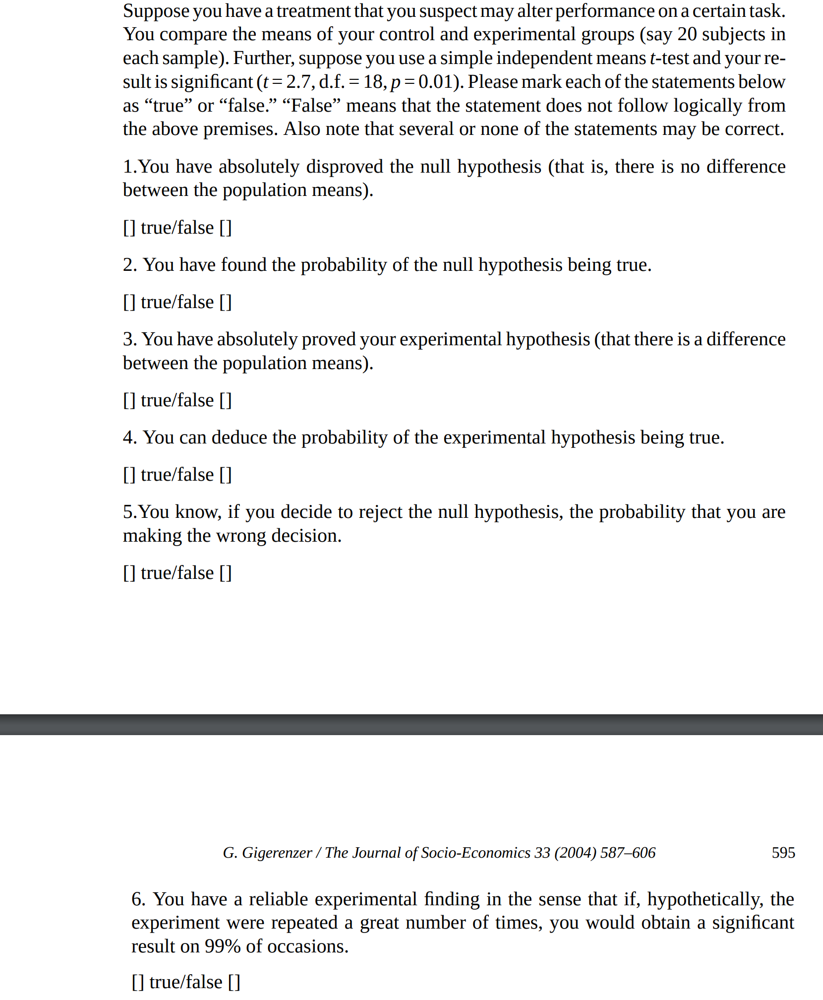

#Regression is everywhere
```{r echo = FALSE, out.width="80%", fig.cap= "120 millions hits on Google"}
knitr::include_graphics("figures/linear_regression_screenshot.png")
```

---
class: clear
```{r echo = FALSE, out.width="70%", fig.cap= "750K articles on PubMed"}
knitr::include_graphics("figures/pubmed_regression.png")
```
---
class: clear
```{r echo = FALSE, warning = FALSE, fig.cap = "Even your exam scores exhibit regression to the mean"}
library(faraway)
library(ggplot2)
data(stat500)
stat500 <- data.frame(scale(stat500))
ggplot(data = stat500, aes(x = midterm, y = final)) +
  geom_point() +  geom_smooth(method = "lm", se = FALSE)
```

---
#Prelude to linear models: curve fitting

```{r message = FALSE, echo = FALSE, cache = FALSE}
set.seed(123)
library(ggplot2)
library(tidyverse)
df <- tibble(x = rnorm(20), y = exp(x) + 2*x^2 + rnorm(20, sd = 0.5))
p <- ggplot(df, aes(x = x, y = y)) + geom_point() + xlab("Foo") + ylab("Bar")
p
```

---
class: clear
Q. How can we use `Foo` to predict `Bar` ?

.pull-left[
```{r}
p + geom_hline(
  yintercept = 0, color="blue")
```
]

--

.pull-right[
```{r}
p + geom_vline(
  xintercept = 0, color = "red")
```
]

---
class: clear
Q. How can we use `Foo` to predict `Bar` ?

.pull-left[
```{r}
p + geom_hline(
  yintercept = mean(df$y), 
  color = "blue")
```
]

--

.pull-right[
```{r fig.cap = "Simple linear regression line"}
p + geom_smooth(
  method = "lm", se = FALSE)
```
]

---
class: clear
.pull-left[
```{r fig.cap = "Quadratic regression line"}
p + geom_smooth(method = "lm", 
  formula = y ~ x + I(x^2),
  se = FALSE, color = "blue")
```
]

--

.pull-right[
```{r fig.cap = "Loess smoothing"}
p + geom_smooth(method = "loess", 
  se = FALSE, color = "blue")
```
]

---
class: clear
.pull-left[
```{r fig.cap = "Linear Interpolation"}
fhat <- approxfun(df$x, df$y)
df.interpolate <- tibble(
  x = seq(min(df$x), max(df$x),
          length.out = 100),
  y = fhat(x))

p + geom_line(data = df.interpolate, 
              aes(x = x, y = y),
              color = "blue")
```
]

--

.pull-right[
```{r fig.cap = "Cubic splines interpolation"}
fhat <- splinefun(df$x, df$y)
df.interpolate <- tibble(
  x = seq(min(df$x), max(df$x),
          length.out = 100),
  y = fhat(x))

p + geom_line(data = df.interpolate, 
              aes(x = x, y = y),
              color = "blue")
```
]
---
class: clear

##Q: Which of the curve "fits" the data the best ?

##A: Which data ? The existing data ? the new data ? the non-noisy data ? the noisy but real data ?

---
class: clear

```{r echo=TRUE, out.width="80%"}
set.seed(123)
df.new <- tibble( x = rnorm(50), fx = exp(x) + 2*x^2, y = fx + rnorm(50, sd = 0.5))
p + geom_smooth(method = "lm", se = FALSE, color = "blue", linetype = "dashed") + 
  geom_smooth(method = "lm", formula = y ~ x + I(x^2), color = "blue") +
  geom_line(data = df.interpolate, aes(x = x, y = y), color = "green", linetype = "dashed") +
  geom_line(data = df.new, aes(x = x, y = fx), color = "red", linetype = "dashed") +
  geom_point(data = df.new, aes(x = x, y = y), color = "red")
```

---
class: clear
In this case the true data is generated as
$$ (Y | X = x) \sim \exp(x) + 2x^2 + N(0, .25) $$
and among the various ways of fitting a curve to the data, the best one is
$$ \hat{f}(x) = 0.98 + 1.3372x + 2.5 x^2. $$
```{r echo = FALSE, out.width="70%"}
p + geom_smooth(method = "lm", formula = y ~ x + I(x^2), color = "blue") +
    geom_line(data = df.new, aes(x = x, y = fx), color = "red", linetype = "dashed") +
    geom_point(data = df.new, aes(x = x, y = y), color = "red")
```

---
# Defining regression.
Given data $\{(X_1, Y_1), \dots, (X_n, Y_n)\} \subset \mathbb{R}^2$, find/estimate a function $f$ such that
$$ Y_i \approx \hat{Y}_i = f(X_i) $$

Q1. Why not just use $\hat{Y}_i = Y_i$ ?

A1. Cannot be use for new data. Is useless for summarizing/understanding existing data. 

--

Q2. But isn't there an infinite number of possible $f$!

A2. Ah, but is there a countable or uncountable number of possible $f$ ?


---
class: clear

So restricting the class/type of $f$ is necessary. 

+ A lot of restrictions $\Longrightarrow$ parametric regression, 
      + $f(x) = 0$
      + $f(x) = \beta_0 + \beta_1 x; \quad \beta_0, \beta_1 \in \mathbb{R}$
      + $f(x) = \sum_{k=0}^{p} \beta_k x^k; \quad \beta_0, \dots, \beta_p \in \mathbb{R}$
      + $f(x) = \sum_{k=0}^{p} \beta_k f_k(x); \quad \beta_, \dots, \beta_p, \in \mathbb{R}, \quad f_k(x)$ are **known** functions.

+ Little or no restrictions $\Longrightarrow$ semiparametric/non-parametric regression
      + $f$ is continuous.
      + $f$ has continuous second-order derivatives on $[-1, 1]$. 
      + $f$ satisfies $\int {(f''(x))^2 \, \mathrm{d}x} \leq 1$.
      + $f = \sum_{k=0}^{p} \beta_k x^k + g(x); \quad \beta_0, \dots, \beta_p \in \mathbb{R}$, and $\int(g''(x))^2 \,\mathrm{d}x \leq 1$. 

---
class: clear
Still, a criteria is needed to select one possible $f$ among an infinite number of possible $f$ (even in the parametric case)

### Least square criterion
$$\hat{f} = \arg\min_{f \in \mathcal{C}} \sum_{i=1}^{n}(Y_i - f(X_i))^2$$
where $\mathcal{C}$ indicates a class of functions to which $f$ should be restricted.

--

Q. Does a minimizer $\hat{f}$ exists ? Can we find one "efficiently" ? 

A. In general, yes if $\mathcal{C}$ is "parametric" and sometimes if $\mathcal{C}$ is semiparametric/non-parametric. 

--


> The method of least squares is the automobile of modern statistical
> analysis: despite its limitations, occasional accidents, and
> incidental pollution, it and its numerous variations, extensions, and
> related conveyances carry the bulk of statistical analyses, and are
> known and valued by nearly all.
> 
> Stigler (1981)

---
class: clear


> The method of least squares was the dominant theme --- the
>   leitmotif --- of nineteenth-century statistics. In several respects
>   it was to statistics what the calculus had been to mathematics a
>   century earlier.  "Proofs" of the method gave direction to the
>   development of statistical theory, handbooks explaining its use
>   guided the application of the higher methods, and disputes on the
>   priority of its discovery signaled the intellectual community's
>   recognition of the method's value. Like the calculus of
>   mathematics, this "calculus of observations" did not spring into
>   existence without antecedents, and the exploration of its
>   subtleties and potential took over a century.
> 
> --- Stigler (1986)

See also S. Stigler article [Gauss and the investion of least squares](https://projecteuclid.org/euclid.aos/1176345451).

---
# Warmup: simple linear regression (I)
Given data $\{(X_1, Y_1), \dots, (X_n, Y_n)\} \subset \mathbb{R}^2$, find/estimate a function $f(x) = \beta_0 + \beta_1 x$ such that
$$ Y_i \approx \hat{Y}_i = f(X_i) $$

Here $f$ is the class of linear functions in $x$ and hence 
$$\hat{f}(x) = \hat{\beta}_0 + \hat{\beta}_1 x \quad \text{where} \quad (\hat{\beta}_0, \hat{\beta}_1) = \arg\min_{b_0, b_1} \sum_{i=1}^{n}(Y_i - b_0 - b_1 X_i)^2.$$

Letting $Q(b_0, b_1)$ be the objective funcion to be minimized, take the patial derivatives of $Q$ with respect to $b_0$ and $b_1$, set the resulting expession to zero and solve for $\hat{\beta}_0$ and $\hat{\beta}_1$, i.e.,
---
class: clear
$$\begin{gather*}
\frac{\partial Q}{\partial b_0} = - \sum_{i} 2 (Y_i - b_0 - b_1
    X_i)  \\
    \frac{\partial Q}{\partial b_1} = - \sum_{i} 2 X_i (Y_i - b_0 -
    b_1 X_i)
\end{gather*}$$

$(\hat{\beta}_0,\hat{\beta}_1)$ is thus **a** solution of 
$$\begin{gather*}\sum_{i}  (Y_i - \hat{\beta}_0 - \hat{\beta}_1    X_i) = 0 \\
 \sum_{i}  X_i (Y_i - \hat{\beta}_0 - \hat{\beta}_1 X_i) = 0
\end{gather*}$$

This is a system of two equations in two unknowns and hence (`ez pz`)
$$
\begin{gather*}
\hat{\beta}_1 = \frac{\sum_{i} (X_i - \bar{X}) (Y_i -
      \bar{Y})}{\sum_{i}(X_i - \bar{X})^2}; \quad \hat{\beta}_0 =
    \bar{Y} - \hat{\beta}_1 \bar{X}
\end{gather*}
$$
where $\bar{X} = n^{-1} \sum_{i} X_i$ and $\bar{Y} = n^{-1} \sum_{i} Y_i$. 

---
# Warmup: simple linear regression (II)
Given data $\{(X_1, Y_1), \dots, (X_n, Y_n)\} \subset \mathbb{R}^2$, find/estimate a function $f(x) = \beta_0 + \beta_1 x + \beta_x^2$ such that
$$ Y_i \approx \hat{Y}_i = f(X_i) $$

Here $f$ is the class of quadratic functions in $x$ and hence 
$$\hat{f}(x) = \hat{\beta}_0 + \hat{\beta}_1 x + \hat{\beta}_2 x^2 \quad \text{where}$$
$$(\hat{\beta}_0, \hat{\beta}_1, \hat{\beta}_2) = \arg\min_{b_0, b_1, b_2} \sum_{i=1}^{n}(Y_i - b_0 - b_1 X_i - b_2 X_i^2)^2.$$

Letting $Q(b_0, b_1, b_2)$ be the objective funcion to be minimized, take the patial derivatives of $Q$ with respect to $b_0$, $b_1$, and $b_2$, set the resulting expession to zero and solve for $\hat{\beta}_0$, $\hat{\beta}_1$, and $\hat{\beta}_2$, i.e.,

---
class: clear
$$\begin{gather*}
\frac{\partial Q}{\partial b_0} = - \sum_{i} 2 (Y_i - b_0 - b_1
    X_i - b_2 X_i^2)  \\
    \frac{\partial Q}{\partial b_1} = - \sum_{i} 2 X_i (Y_i - b_0 -
    b_1 X_i - b_2 X_i^2) \\
    \frac{\partial Q}{\partial b_2} = - \sum_{i} 2 X_i^2 (Y_i - b_0 -
    b_1 X_i - b_2 X_i^2)  
\end{gather*}$$

Letting $Z_i = X_i^2$, 
$(\hat{\beta}_0, \hat{\beta}_1, \hat{\beta}_2)$ is thus **a** solution of 
$$\begin{gather*}\sum_{i}  (Y_i - \hat{\beta}_0 - \hat{\beta}_1 X_i - \hat{\beta}_2 Z_i) = 0 \\
 \sum_{i} X_i (Y_i - \hat{\beta}_0 - \hat{\beta}_1 X_i - \hat{\beta}_2 Z_i) = 0 \\
  \sum_{i}  Z_i (Y_i - \hat{\beta}_0 - \hat{\beta}_1 X_i - \hat{\beta}_2 Z_i) = 0
\end{gather*}$$

---
class: clear
This is a system of three equations in three unknowns and hence (`ez ez`)
$$\begin{gather*}
  \hat{\beta}_2 = \tfrac{\sum_{i} (Z_i - \bar{Z})^2 \sum_{i} (X_i - \bar{X}) (Y_i - \bar{Y}) - \sum_{i} (X_i - \bar{X})(Z_i - \bar{Z}) \sum_{i} (Z_i - \bar{Z}) (Y_i - \bar{Y})}{\sum_{i}(X_i - \bar{X})^2 \sum_{i}(Z_i - \bar{Z})^2 - \Bigl(\sum_{i}(X_i - \bar{X})(Z_i - \bar{Z})\Bigr)^2} \\
    \hat{\beta}_2 = \tfrac{\sum_{i} (X_i - \bar{X})^2 \sum_{i} (Z_i - \bar{Z}) (Y_i - \bar{Y}) - \sum_{i} (X_i - \bar{X})(Z_i - \bar{Z}) \sum_{i} (X_i - \bar{X}) (Y_i - \bar{Y})}{\sum_{i}(X_i - \bar{X})^2 \sum_{i}(Z_i - \bar{Z})^2 - \Bigl(\sum_{i}(X_i - \bar{X})(Z_i - \bar{Z})\Bigr)^2} \\
    \hat{\beta}_0 = \bar{Y} - \hat{\beta}_1 \bar{X} - \hat{\beta}_2 \bar{Z}
\end{gather*}$$
where $\bar{X} = n^{-1} \sum_{i} X_i$, $\bar{Y} = n^{-1} \sum_{i} Y_i$, and $\bar{Z} = n^{-1} \sum_{i} Z_i$.

This system of solutions does not depend on $Z_i = X_i^2$.

---
# Warmup: Simple linear regression (III)
Given data $\{(X_1, Y_1, Z_1, W_1), \dots, (X_n, Y_n, Z_n, W_n)\} \subset \mathbb{R}^4$, find/estimate a function $f(x,z,w) = \beta_0 + \beta_1 x + \beta_2 z + \beta_3 w$ such that
$$ Y_i \approx \hat{Y}_i = f(X_i, Z_i, W_i) $$

$\hat{f}$ now satifies

$$(\hat{\beta}_0, \hat{\beta}_1, \hat{\beta}_2, \hat{\beta}_3) = \arg\min_{b_0, b_1, b_2, b_3} \sum_{i=1}^{n}(Y_i - b_0 - b_1 X_i - b_2 Z_i - b_3 W_i)^2.$$

Letting $Q(b_0, b_1, b_2, b_3)$ be the objective funcion to be minimized, take the patial derivatives of $Q$ with respect to $b_0$, $b_1$, $b_2$, and $b_3$ and set the resulting expession to zero and solve for $\hat{\beta} = (\hat{\beta}_0, \hat{\beta}_1, \hat{\beta}_2, \hat{\beta}_3)$ now yield a system of four equations in four unknowns whole solution is `ez ez` ...
---
class: clear

### I don't know!!! Stop making me do algebra!!! Let me do linear algebra!!!

--

```{r echo = FALSE, out.width="50%"}
knitr::include_graphics("https://imgs.xkcd.com/comics/machine_learning_2x.png")
```

---
#Enter the matrix!

Recall the previous system of equations for $\hat{\beta}_0$ and $\hat{\beta}_1$
$$\begin{gather*}\sum_{i}  (Y_i - \hat{\beta}_0 - \hat{\beta}_1    X_i) = 0 \\
 \sum_{i}  X_i (Y_i - \hat{\beta}_0 - \hat{\beta}_1 X_i) = 0
\end{gather*}$$

Define
$$\boldsymbol{y} = \begin{bmatrix} Y_1 \\ Y_2 \\ \vdots \\ Y_n \end{bmatrix} \in \mathbb{R}^{n}; \quad \boldsymbol{x} = \begin{bmatrix} X_1 \\ X_2 \\ \vdots \\ X_n \end{bmatrix} \in \mathbb{R}^{n}; \quad \boldsymbol{1} = \begin{bmatrix} 1 \\ 1 \\ \vdots \\ 1 \end{bmatrix} \in \mathbb{R}^{n}.$$
The above system of equations can be rewritten as
$$\begin{gather*}\boldsymbol{y}^{\top} \boldsymbol{1} - \hat{\beta}_0 \boldsymbol{1}^{\top} \boldsymbol{1} - \hat{\beta}_1 \boldsymbol{x}^{\top} \boldsymbol{1} = 0 \\
\boldsymbol{y}^{\top} \boldsymbol{x} - \hat{\beta}_0 \boldsymbol{x}^{\top} \boldsymbol{1} - \hat{\beta}_1 \boldsymbol{x}^{\top} \boldsymbol{x} = 0\end{gather*}$$
---
class: clear
This is equivalent to
$$\begin{bmatrix} \boldsymbol{1}^{\top} \boldsymbol{1} & \boldsymbol{1}^{\top}\boldsymbol{x} \\ \boldsymbol{x}^{\top} \boldsymbol{1} & \boldsymbol{x}^{\top} \boldsymbol{x} \end{bmatrix} \begin{bmatrix} \hat{\beta}_0 \\ \hat{\beta}_1 \end{bmatrix} = \begin{bmatrix} \boldsymbol{y}^{\top}\boldsymbol{1} \\ \boldsymbol{y}^{\top} \boldsymbol{x} \end{bmatrix}.$$
Now define 
$$\mathbf{X} = \underbrace{\begin{bmatrix} \boldsymbol{1} & \boldsymbol{x} \end{bmatrix}}_{n \times 2}; \quad \hat{\boldsymbol{\beta}} = \begin{bmatrix} \hat{\beta}_0 \\ \hat{\beta}_1 \end{bmatrix} \in \mathbb{R}^2$$
The above equation is then equivalent to
$$\mathbf{X}^{\top} \mathbf{X} \hat{\boldsymbol{\beta}} = \mathbf{X}^{\top} \boldsymbol{y}.$$

---
class: clear
Let us try the same idea for two variables $X$ and $Z$. Recall
$$\begin{gather*}\sum_{i}  (Y_i - \hat{\beta}_0 - \hat{\beta}_1 X_i - \hat{\beta}_2 Z_i) = 0 \\
 \sum_{i} X_i (Y_i - \hat{\beta}_0 - \hat{\beta}_1 X_i - \hat{\beta}_2 Z_i) = 0 \\
  \sum_{i}  Z_i (Y_i - \hat{\beta}_0 - \hat{\beta}_1 X_i - \hat{\beta}_2 Z_i) = 0
\end{gather*}$$

Define
$$\boldsymbol{y} = \begin{bmatrix} Y_1 \\ Y_2 \\ \vdots \\ Y_n \end{bmatrix} \in \mathbb{R}^{n}; \quad \boldsymbol{x} = \begin{bmatrix} X_1 \\ X_2 \\ \vdots \\ X_n \end{bmatrix} \in \mathbb{R}^{n}; \quad \boldsymbol{z} = \begin{bmatrix} Z_1 \\ Z_2 \\ \vdots \\ Z_n \end{bmatrix} \in \mathbb{R}^{n}; \quad \boldsymbol{1} = \begin{bmatrix} 1 \\ 1 \\ \vdots \\ 1 \end{bmatrix} \in \mathbb{R}^{n}.$$

Then
$$\begin{gather*}\boldsymbol{y}^{\top} \boldsymbol{1} - \hat{\beta}_0 \boldsymbol{1}^{\top} \boldsymbol{1} - \hat{\beta}_1 \boldsymbol{x}^{\top} \boldsymbol{1} - \hat{\beta}_2 \boldsymbol{z}^{\top} \boldsymbol{1} = 0 \\
\boldsymbol{y}^{\top} \boldsymbol{x} - \hat{\beta}_0 \boldsymbol{1}^{\top} \boldsymbol{x} - \hat{\beta}_1 \boldsymbol{x}^{\top} \boldsymbol{x} - \hat{\beta}_2 \boldsymbol{z}^{\top} \boldsymbol{x} = 0 \\
\boldsymbol{y}^{\top} \boldsymbol{z} - \hat{\beta}_0 \boldsymbol{1}^{\top} \boldsymbol{z} - \hat{\beta}_1 \boldsymbol{x}^{\top} \boldsymbol{z} - \hat{\beta}_2 \boldsymbol{z}^{\top} \boldsymbol{z} = 0\end{gather*}$$

---
class: clear
This is equivalent to
$$\begin{bmatrix} \boldsymbol{1}^{\top} \boldsymbol{1} & \boldsymbol{1}^{\top}\boldsymbol{x} & \boldsymbol{1}^{\top} \boldsymbol{x} \\ \boldsymbol{x}^{\top} \boldsymbol{1} & \boldsymbol{x}^{\top} \boldsymbol{x} & \boldsymbol{x}^{\top} \boldsymbol{z} \\
\boldsymbol{z}^{\top} \boldsymbol{1} & \boldsymbol{z}^{\top} \boldsymbol{x} & \boldsymbol{z}^{\top} \boldsymbol{z} \end{bmatrix} \begin{bmatrix} \hat{\beta}_0 \\ \hat{\beta}_1 \\ \hat{\beta}_2 \end{bmatrix} = \begin{bmatrix} \boldsymbol{y}^{\top}\boldsymbol{1} \\ \boldsymbol{y}^{\top} \boldsymbol{x} \\ \boldsymbol{y}^{\top} \boldsymbol{z} \end{bmatrix}.$$

Now define 
$$\mathbf{X} = \underbrace{\begin{bmatrix} \boldsymbol{1} & \boldsymbol{x} & \boldsymbol{z} \end{bmatrix}}_{n \times 3}; \quad \hat{\boldsymbol{\beta}} = \begin{bmatrix} \hat{\beta}_0 \\ \hat{\beta}_1 \\ \hat{\beta}_2 \end{bmatrix} \in \mathbb{R}^3$$
The above equation is then equivalent to
$$\mathbf{X}^{\top} \mathbf{X} \hat{\boldsymbol{\beta}} = \mathbf{X}^{\top} \boldsymbol{y}.$$

---
# The normal equation

Let $\{(Y_i, X^{(1)}_i, X^{(2)}_i, \dots, X^{(p-1)}_i)\}_{i=1}^{n}$ be $n$ data points. For the $i$th observation, $Y_i$ is the value of the response variable and $X_i^{(k)}$ is the value of the $k$th predictor variable.
Denote
$$\boldsymbol{y} = \begin{bmatrix} Y_1 \\ Y_2 \\ \vdots \\ Y_n \end{bmatrix}; \quad \boldsymbol{x}^{(k)} = \begin{bmatrix} X^{(k)}_1 \\ X^{(k)}_2 \\ \vdots \\  X^{(k)}_n \end{bmatrix}; \quad \mathbf{X} = \underbrace{[\boldsymbol{1}, \boldsymbol{x}^{(1)},  \boldsymbol{x}^{(2)}, \dots, \boldsymbol{x}^{(p-1)}]}_{n \times p}; \quad \boldsymbol{b} = \begin{bmatrix} b_0 \\ b_1 \\ \vdots \\ b_{p-1} \end{bmatrix}$$


Recall that for a **column** vector $\boldsymbol{a} = (a_1, a_2, \dots, a_n)^{\top} \in \mathbb{R}^{n}$,
$$\boldsymbol{a}^{\top} \boldsymbol{a} = \sum_{i=1}^{n} a_i^2.$$

The least square criterion for fitting $Y_i \approx \beta_0 + \sum_{k=1}^{p-1} \beta_k X^{(k)}_i$ is

$$\min_{\boldsymbol{b}} \sum_{i=1}^{n} (Y_i - b_0 - b_1 X^{(1)}_i - b_2 X^{(2)}_i - \dots - b_{p-1} X^{(p-1)}_i)^2 = \min_{\boldsymbol{b}} (\boldsymbol{y} - \mathbf{X} \boldsymbol{b})^{\top} (\boldsymbol{y} - \mathbf{X} \boldsymbol{b}).$$

---
class: clear

Define $Q(\boldsymbol{b}) = (\boldsymbol{y} - \mathbf{X} \boldsymbol{b})^{\top} (\boldsymbol{y} - \mathbf{X} \boldsymbol{b})$. 

Suppose there exists a $\hat{\boldsymbol{\beta}}$ satisfying the **normal equation**
$\mathbf{X}^{\top} \mathbf{X} \hat{\boldsymbol{\beta}} = \mathbf{X}^{\top} \boldsymbol{y}$, i.e.,
$$\mathbf{X}^{\top} \mathbf{X} \hat{\boldsymbol{\beta}} - \mathbf{X}^{\top} \boldsymbol{y} = \mathbf{X}^{\top}(\mathbf{X} \hat{\boldsymbol{\beta}} - \boldsymbol{y}) = 0.$$
Then for all $\boldsymbol{b}$
$$\begin{split}Q(\boldsymbol{b}) &= (\boldsymbol{y} - \mathbf{X} \boldsymbol{b})^{\top}(\boldsymbol{y} - \mathbf{X} \boldsymbol{b}) \\ &= 
(\boldsymbol{y} - \mathbf{X} \hat{\boldsymbol{\beta}} + \mathbf{X} \hat{\boldsymbol{\beta}} - \mathbf{X} \boldsymbol{b})^{\top}(\boldsymbol{y} - \mathbf{X} \hat{\boldsymbol{\beta}} + \mathbf{X} \hat{\boldsymbol{\beta}} - \mathbf{X} \boldsymbol{b}) \\
&= Q(\hat{\boldsymbol{\beta}}) + (\boldsymbol{y} - \mathbf{X} \hat{\boldsymbol{\beta}})^{\top} \mathbf{X} (\hat{\boldsymbol{\beta}} - \boldsymbol{b}) - (\hat{\boldsymbol{\beta}} - \boldsymbol{b})^{\top} \mathbf{X}^{\top}  (\boldsymbol{y} - \mathbf{X} \hat{\boldsymbol{\beta}}) + (\hat{\boldsymbol{\beta}} - \boldsymbol{b})^{\top} \mathbf{X}^{\top} \mathbf{X} (\hat{\boldsymbol{\beta}} - \boldsymbol{b}) \\
&= Q(\hat{\boldsymbol{\beta}}) + (\boldsymbol{y} - \mathbf{X} \hat{\boldsymbol{\beta}})^{\top} \mathbf{X} (\hat{\boldsymbol{\beta}} - \boldsymbol{b}) + 0 + (\hat{\boldsymbol{\beta}} - \boldsymbol{b})^{\top} \mathbf{X}^{\top} \mathbf{X} (\hat{\boldsymbol{\beta}} - \boldsymbol{b}) \\ 
&= Q(\hat{\boldsymbol{\beta}}) + 0 + 0 + (\hat{\boldsymbol{\beta}} - \boldsymbol{b})^{\top} \mathbf{X}^{\top} \mathbf{X} (\hat{\boldsymbol{\beta}} - \boldsymbol{b}) \\
& \geq Q(\hat{\boldsymbol{\beta}}) \end{split}$$

since, defining $\boldsymbol{w} = \mathbf{X} (\hat{\boldsymbol{\beta}} - \boldsymbol{b})$, we have
$(\hat{\boldsymbol{\beta}} - \boldsymbol{b})^{\top} \mathbf{X}^{\top} \mathbf{X} (\hat{\boldsymbol{\beta}} - \boldsymbol{b}) = \boldsymbol{w}^{\top} \boldsymbol{w} \geq 0$. 

---
class: clear

Q. When does the normal equation
$\mathbf{X}^{\top} \mathbf{X} \hat{\boldsymbol{\beta}} = \mathbf{X}^{\top} \boldsymbol{y}$
has a solution ?

A. Always!

+ A direct argument when $\mathbf{X}$ (which is a $n \times p$ matrix), has $p$ linearly independent columns is as follows. Since $\mathbf{X}^{\top} \mathbf{X}$ is a $p \times p$ matrix, for any $\boldsymbol{v} \in \mathbb{R}^{p}$, 
$$\mathbf{X}^{\top} \mathbf{X} \boldsymbol{v} = 0 \Longrightarrow \boldsymbol{v}^{\top} \mathbf{X}^{\top} \mathbf{X} \boldsymbol{v} = 0 \Longrightarrow \mathbf{X} \boldsymbol{v} = 0 \Longrightarrow \boldsymbol{v} = \boldsymbol{0}$$
The columns of $\mathbf{X}^{\top} \mathbf{X}$ are thus linearly independent and $\mathbf{X}^{\top} \mathbf{X}$ is invertible. Hence
$$\hat{\boldsymbol{\beta}} = (\mathbf{X}^{\top} \mathbf{X})^{-1} \mathbf{X}^{\top} \boldsymbol{y}.$$
+ The above solution for $\hat{\boldsymbol{\beta}}$ is valid (and hence unique) only if $\mathbf{X}$ is of full-column rank.

+ If $\mathbf{X}$ is not of full-column rank, then there are an **infinite** number of possible solutions $\hat{\boldsymbol{\beta}}$; however, the **fitted** values $\hat{\boldsymbol{y}} = \mathbf{X} \hat{\boldsymbol{\beta}}$ will still be **unique**.

+ We will now assume, unless specified otherwise, that $\mathbf{X}$ is of full column rank.

---
#An example: SAT score and spending
```{r echo = -c(3,4)}
library(faraway)
data(sat)
sat$state <- rownames(sat)
sat <- sat %>% select(state, everything())
sat
```

---
class: clear
```{r}
mod <- lm(math ~ expend + ratio + salary, data = sat)
mod.alt <- lm(math ~ expend + ratio, data = sat)
summary(mod)
```
---
class: clear
```{r warning=FALSE, message = FALSE, echo = TRUE}
summary(mod.alt)
```
---
class: clear
```{r}
## Note the negative correlation between expenditure and math
## also the negative correlation betwen salary and math
## and the positive correlation between salary and expenditure.
cor(sat[c('math','expend','ratio','salary')]) 
```
---
class: clear
```{r output.lines = 12}
model.matrix(mod) ## Design matrix
X <- model.matrix(mod)
## solve denotes matrix inverse, t denote matrix transpose
beta.hat <- solve(t(X) %*% X) %*% t(X) %*% sat$math 
t(beta.hat)
```
---
# How to interpret a coefficent ?
```{r}
  library("SenSrivastava")
  data(E2.2)
  E2.2
```
 The housing price dataset from the **R** library \texttt{SenSrivastava}. The dataset
  contains information about the selling price of
  $`r nrow(E2.2)`$ houses in the Chicago area.

---
class: clear
```{r output.lines = 20}
  mdl <- lm(Price ~ FLR + RMS + BDR + BTH + GAR + LOT + FP + ST, E2.2)
  summary(mdl)
```

---
class: clear
```{r}
cor(E2.2[c('Price','FLR','RMS','BDR','BTH','GAR','LOT','FP','ST')])
coefficients(mdl)
```

How should we interpret the coefficients ? For example, \texttt{BDR},
the variable describing the number of bedrooms in the house, has a
negative coefficient when used to predict the selling price.

---
class: clear

Q. What does $\hat{\beta}_i$ means in a regression with observational data ?

+ A1. "A unit change in the $i$-th predictor variable will produce, or is associated with, a
    change of $\hat{\beta}_i$ in the response". This is, on many occasions, invalid as there might be lurking
    variables. For example, a unit change in shoe size do not really produce a change in $\hat{\beta}_i$ in aptitude in small children.

+ A2. "$\hat{\beta}_i$ is the effect of the $i$-th variable when all
    the other variables are held constant". In practice, individual
    variables are intertwined, e.g., number of bedrooms and number of
    rooms in a house, tax rates and budget. This also require
    specification of the other predictor variables.
    
+ A3: Ignore interpretation. Just focus on prediction a la Leo Breiman's [Statistical Modeling: The two cultures](https://projecteuclid.org/euclid.ss/1009213726)). But then there is no understanding ? Just blackbox magic ?

---
# Inference in linear models
Given $n$ data points $\{(Y_i, X^{(1)}_i, X^{(2)}_i, \dots, X^{(p-1)}_i)\}_{i=1}^{n}$, suppose we fit a linear model
$$Y_i \approx \beta_0 + \sum_{k=1}^{p-1} \beta_k X^{(k)}_i$$
by minimizing the least squares criterion and obtain $\hat{\boldsymbol{\beta}}$. We compute the fitted value and the mean square error
$$\hat{\boldsymbol{y}} = \mathbf{X} \hat{\boldsymbol{\beta}}; \quad \mathrm{MSE} = \frac{1}{n} \sum_{i=1}^{n}(Y_i - \hat{Y}_i)^2 = \frac{1}{n} (\boldsymbol{y} - \hat{\boldsymbol{y}})^{\top} (\boldsymbol{y} - \hat{\boldsymbol{y}}).$$

But is that all we can do ? What about the following ?
+ Does the model fit the data well ?
+ Can we find a simpler but "equivalent" model ?
+ Can we find a "better" model (by adding more variables or transforming variables) ?
+ Are the coefficients $\hat{\boldsymbol{\beta}}$ "accurate" or "meaningful" ?

---
class: clear
To address these questions and more, we will need, at the minimum, some assumptions on the **observed** data. 

The simplest assumptions are that there exists $\beta_0, \beta_1, \dots, \beta_{p-1}$ such that
$$\begin{gather*}
Y_i = \beta_0 + \sum_{k=1}^{p-1} \beta_k X^{(k)}_i + \color{red}{\epsilon_i} \\
\mathbb{E}[\epsilon_i] = 0 \quad \text{for all} \,\, i \\
\mathbb{E}[\epsilon_i^2] = \mathrm{Var}[\epsilon_i] =  \sigma^2 \quad \text{for all} \,\, i \\
\mathbb{E}[\epsilon_i \epsilon_j] = 0 \quad \text{for all} \,\, i \not = j
\end{gather*}$$

This then implies the **linear model**
$$\boldsymbol{y} = \mathbf{X} \boldsymbol{\beta} + \boldsymbol{\epsilon}; \quad \boldsymbol{\epsilon} = \begin{bmatrix} \epsilon_1 \\ \epsilon_2 \\ \vdots \\ \epsilon_n \end{bmatrix}, \quad \mathbb{E}[\boldsymbol{\epsilon}] = \boldsymbol{0}, \quad \mathrm{Var}[\boldsymbol{\epsilon}] = \sigma^2 \mathbf{I}.$$
---
class: clear

With the above assumptions,

+ $\hat{\boldsymbol{\beta}} = (\mathbf{X}^{\top} \mathbf{X})^{-1} \mathbf{X}^{\top} \boldsymbol{y}$ is an **estimate** (hence a random variable) of $\boldsymbol{\beta}$ and satisfies
$$\mathbb{E}[\hat{\boldsymbol{\beta}}] = \boldsymbol{\beta}; \quad \mathrm{Var}[\hat{\boldsymbol{\beta}}] = (\mathbf{X}^{\top} \mathbf{X})^{-1} \mathbf{X}^{\top} \mathrm{Var}[\boldsymbol{\epsilon}] \mathbf{X} (\mathbf{X}^{\top} \mathbf{X})^{-1} = \sigma^2 (\mathbf{X}^{\top} \mathbf{X})^{-1}.$$

+ The fitted value $\hat{\boldsymbol{y}} = \mathbf{X} \hat{\boldsymbol{\beta}}$ satisfies
$$\begin{gather*} \mathbb{E}[\hat{Y}_i] = Y_i; \quad \mathrm{Var}[\hat{Y}_i] = \sigma^2 \boldsymbol{x}_i^{\top} (\mathbf{X}^{\top} \mathbf{X})^{-1} \boldsymbol{x}_i = \sigma^2 h_{ii}; \\ \mathrm{Var}[\hat{\boldsymbol{y}}] = \sigma^2 \mathbf{X} (\mathbf{X}^{\top} \mathbf{X})^{-1} \mathbf{X}^{\top} \end{gather*}.$$
where $\boldsymbol{x}_i^{\top}$ is the $i$th-row of $\mathbf{X}$ and $h_{ii}$ is the $i$th **diagonal** element of the $n \times n$ hat matrix $\mathbf{H} = \mathbf{X}(\mathbf{X}^{\top} \mathbf{X})^{-1} \mathbf{X}^{\top}$

+ For a new set of predictor variables $\boldsymbol{x}_* \in \mathbb{R}^{p}$, $\hat{Y}_* = \boldsymbol{x}_* \hat{\boldsymbol{\beta}}$ is an estimate of the **expected** value $\mathbb{E}[Y_*]$ with $\mathrm{Var}[\hat{Y}_*] = \sigma^2 \boldsymbol{x}_*^{\top} (\mathbf{X}^{\top} \mathbf{X})^{-1} \boldsymbol{x}_*$.


+ (**Important**) The above expressions are interpreted under the assumption that

  -   The model $\boldsymbol{y} = \mathbf{X} \boldsymbol{\beta} + \boldsymbol{\epsilon}$ is really true and

  - Repeated sampling of $\boldsymbol{y}$ with $\mathbf{X}$ fixed.

---
class: clear

+ The **estimated** covariance matrix of the **estimator** $\hat{\boldsymbol{\beta}}$ is then
$$ \widehat{\mathrm{Var}}[\hat{\boldsymbol{\beta}}] = \mathrm{MSE} \times (\mathbf{X}^{\top} \mathbf{X})^{-1}.$$

+ The **estimated** covariance matrix of the **fitted** values $\hat{\boldsymbol{y}} = \mathbf{X} \hat{\boldsymbol{\beta}}$ and the estimated variance of a new prediction $\hat{Y}_* = \boldsymbol{x}_* \hat{\boldsymbol{\beta}}$ are
$$\widehat{\mathrm{Var}}[\hat{\boldsymbol{y}}] = \mathrm{MSE} \times \mathbf{X} (\mathbf{X}^{\top} \mathbf{X})^{-1} \mathbf{X}^{\top}; \quad \widehat{\mathrm{Var}}[\hat{Y}_*] = \mathrm{MSE} \times \boldsymbol{x}_*^{\top} (\mathbf{X}^{\top} \mathbf{X})^{-1} \mathbf{X}^{\top}.$$
---
class: clear
```{r}
## mod is the SAT model
summary(mod)$coefficients 
## estimated covariance matrix for the coefficients
summary(mod)$sigma^2* summary(mod)$cov.unscaled 
## equivalently: 
## X <- model.matrix(mod)
## summary(mod)$sigma^2 * solve(t(X) %*% X)
```

---
class: clear
```{r output.lines = 8}
influence(mod)$hat ## Give the diagonal entries of the hat matrix H.
```

It is always the case that the diagonal entries of $\mathbf{H} = \mathbf{X} (\mathbf{X}^{\top} \mathbf{X})^{-1} \mathbf{X}^{\top}$ are less than $1$. Hence, the **fitted** values are "optimistic" (has variance less than the true variance). Indeed, since the fitted value $\hat{Y}_i$ are the **estimates** of the **expected** value $\mathbb{E}[Y_i]$. This is a feature not a bug. In general, as $n$ increases, the diagonal entries $h_{ii}$ decreases to $0$.

---
# The (multivariate) normal distribution

> Everyone believes in the normal law of errors: the
> mathematicians, because they think it is an experimental fact; and the
> experimenters, because they suppose it is a theorem of mathematics.
>
> Gabriel Lippman

We recall that a random variable $Z$ is said to have the *normal* or
  *Gaussian* distribution with mean $\mu$ and variance $\sigma^2 > 0$ if its probability density function is
$$\frac{1}{\sqrt{2 \pi \sigma^2}} \exp\Bigl( - \frac{(z - \mu)^2}{2\sigma^2}\Bigr).$$
We denote this as $Z \sim N(\mu, \sigma^2)$.

---
class: clear

Now let $Z_1, Z_2, \dots, Z_n$ be i.i.d. $N(0,1)$. The joint distribution of $\boldsymbol{z} = (Z_1, Z_2, \dots, Z_n)$ has probability density function
$$(2 \pi)^{-n/2} \prod_{i=1}^{n} \exp\Bigl(-\frac{Z_i^2}{2}\Bigr) = (2 \pi)^{-n/2} \exp( - \frac{1}{2} \sum_{i=1}^{n} z_i^2) = (2 \pi)^{-n/2} \exp(-\frac{1}{2} \boldsymbol{z}^{\top} \boldsymbol{z}).$$
We denote this as $\boldsymbol{z} \sim \mathrm{MVN}(\boldsymbol{0}, \mathbf{I})$.

The general definition of a multivariate normal random vector is then simply

**Definition**: $\boldsymbol{x}$ is said to be a $p$-dimensional multivariate normal random vector with mean $\boldsymbol{\mu} \in \mathbb{R}^{p}$ and $p \times p$ covariance matrix $\boldsymbol{\Sigma}$ if and only if there exists a $p \times q$ matrix $\mathbf{A}$ with $q = \mathrm{rk}(\boldsymbol{\Sigma}) \leq p$ such that $\boldsymbol{\Sigma} = \mathbf{A} \mathbf{A}^{\top}$ and
$$\boldsymbol{x} = \mathbf{A} \boldsymbol{z} + \boldsymbol{\mu}; \quad \boldsymbol{z} = (Z_1, Z_2, \dots, Z_q) \sim \mathrm{MVN}(0, \mathbf{I}).$$
We denote this as $\boldsymbol{x} \sim \mathrm{MVN}(\boldsymbol{\mu}, \boldsymbol{\Sigma})$.

---
class: clear

+ In essence, a multivariate normal random vector is an **affine combination** of independent standard normal random variables.

+ Therefore, if $\boldsymbol{x} \sim \mathrm{MVN}(\boldsymbol{\mu}, \boldsymbol{\Sigma})$ for some $\boldsymbol{\mu} \in \mathbb{R}^{p}$ and $p \times p$ matrix $\boldsymbol{\Sigma}$, then for any $q \times p$ matrix $\mathbf{B}$ and $\boldsymbol{\nu} \in \mathbb{R}^{q}$, 
$$\mathbf{B} \boldsymbol{x} + \boldsymbol{\nu} \sim \mathrm{MVN}(\mathbf{B} \boldsymbol{\mu} + \boldsymbol{\nu}, \mathbf{B} \boldsymbol{\Sigma} \mathbf{B}^{\top}).$$

+ In the case when $\boldsymbol{\Sigma}$ is a $p \times p$ **invertible** matrix, then $\boldsymbol{x}$ has a probability density function of the form
$$(2 \pi)^{-n/2} \mathrm{det}(\boldsymbol{\Sigma})^{-1/2} \exp\Bigl(-\frac{1}{2} (\boldsymbol{x} - \boldsymbol{\mu})^{\top} \boldsymbol{\Sigma}^{-1} (\boldsymbol{x} - \boldsymbol{\mu})\Bigr).$$

+ If $\boldsymbol{\Sigma}$ is not invertible, then $\boldsymbol{x}$ has neither a probability density function nor a probability mass function.

---
class: clear

The derivation of the density for the multivariate normal (in one direction) is as follows.
Let $\mathbf{A}$ be a $p \times p$ invertible matrix and $\boldsymbol{z} = (z_1, z_2, \dots, z_p) \sim \mathrm{MVN}(0, \mathbf{I})$. Define $\boldsymbol{x} = \mathbf{A} \boldsymbol{z} + \boldsymbol{\mu}$ for some $\boldsymbol{\mu} \in \mathbb{R}^{p}$. Then given a "nice" set $S \subset \mathbb{R}^{p}$, 

$$\begin{split}\mathrm{pr}(\boldsymbol{x} \in S) & = \int_{S} g(\boldsymbol{x}) d \boldsymbol{x} \\ &= \int_{\mathbf{A}^{-1}(S - \boldsymbol{\mu})} f(\boldsymbol{z}) d \boldsymbol{z} \\ &= \int_{S} f(\mathbf{A}^{-1}(\boldsymbol{x} - \boldsymbol{\mu})) \times \mathrm{det}(\mathbf{A}^{-1}) \, d \boldsymbol{x} \\
&= \int_{S} (2 \pi)^{-n/2} \mathrm{det}(\mathbf{A}^{-1}) \exp\Bigl(-\frac{1}{2} (\mathbf{A}^{-1}(\boldsymbol{x} - \boldsymbol{\mu}))^{\top}(\mathbf{A}^{-1}(\boldsymbol{x} - \boldsymbol{\mu})\Bigr) \mathrm{d} \boldsymbol{x}
\\ &= (2 \pi)^{-n/2} \mathrm{det}(\boldsymbol{\Sigma})^{-1/2} \exp\Bigl(-\frac{1}{2} (\boldsymbol{x} - \boldsymbol{\mu})^{\top} \boldsymbol{\Sigma}^{-1} (\boldsymbol{x} - \boldsymbol{\mu})\Bigr).
\end{split}$$

where $\boldsymbol{\Sigma} = \mathbf{A} \mathbf{A}^{\top}$ and hence $\boldsymbol{\Sigma}^{-1} = (\mathbf{A}^{-1})^{\top} \mathbf{A}^{-1}$ and $\mathrm{det}(\boldsymbol{\Sigma}) = (\mathrm{det}(\mathbf{A}))^{2}$.

The reverse direction, i.e., given an invertible covariance matrix $\boldsymbol{\Sigma}$, find the density, requires a bit more terminology and definitions that will be introduced later.

---
#Independence in multivariate normals

**Proposition** Let $\boldsymbol{x} \sim \mathrm{MVN}(\boldsymbol{\mu}, \boldsymbol{\Sigma})$ be a $p$-dimensional multivariate normal. Supose
$\boldsymbol{x}$ can be decompose as
$$\boldsymbol{x} = \begin{bmatrix} \boldsymbol{x}_1 \\ \boldsymbol{x}_2 \end{bmatrix}; \quad \boldsymbol{x}_1 \in \mathbb{R}^{q}, \,\, \boldsymbol{x}_2 \in \mathbb{R}^{p - q}$$
Then $\boldsymbol{x}_1$ and $\boldsymbol{x}_2$ are **independent** if and only if $\mathrm{Cov}(\boldsymbol{x}_1, \boldsymbol{x}_2) = \boldsymbol{0}_{q \times (p-q)}$. 

The previous proposition can be restated as: if $(\boldsymbol{u}, \boldsymbol{v})$ is **jointly** mulivariate normal, then $\boldsymbol{u}$ and $\boldsymbol{v}$ are independent if and only if $\boldsymbol{u}$ and $\boldsymbol{v}$ are **uncorrelated**.

As a consequence of this proposition, let $\boldsymbol{x} \sim \mathrm{MVN}(\boldsymbol{\mu}, \boldsymbol{\Sigma})$ be a $p$-dimensional multivariate normal. Let $\mathbf{A}$ and $\mathbf{B}$ be deterministic $q \times p$ and $r \times p$ matrices. Then $\mathbf{A} \boldsymbol{x}$ and $\mathbf{B} \boldsymbol{x}$ are independent if and only if
$$\mathrm{Cov}(\mathbf{A} \boldsymbol{x}, \mathbf{B} \boldsymbol{x}) = \mathbf{A} \boldsymbol{\Sigma} \mathbf{B}^{\top} = \boldsymbol{0}.$$

---
class: clear

**Example**: We now demonstrate that if $Y_1, Y_2, \dots, Y_n$ are i.i.d. $N(\mu, \sigma^2)$ then the sample mean and the sample variance are independent. Let $\boldsymbol{y} = (Y_1, Y_2, \dots, Y_n)$ then $\boldsymbol{y} \sim \mathrm{MVN}(\mu \times \boldsymbol{1}, \sigma^2 \mathbf{I})$. Now $$\begin{gather*}\bar{Y} = \frac{1}{n}\boldsymbol{1}^{\top} \boldsymbol{y}; \quad (Y_1 - \bar{Y}, Y_2 - \bar{Y}, \dots, Y_n - \bar{Y}) = \boldsymbol{y} - \frac{1}{n} \boldsymbol{1} \boldsymbol{1}^{\top} \boldsymbol{y} = (\mathbf{I} - \frac{\boldsymbol{1}\boldsymbol{1}^{\top}}{n}) \boldsymbol{y}; \\ \mathrm{Cov}(\bar{Y}, (Y_1 - \bar{Y}, \dots, Y_n - \bar{Y})) = \mathrm{Cov}(\frac{1}{n}\boldsymbol{1}^{\top},(\mathbf{I} - \frac{\boldsymbol{1}\boldsymbol{1}^{\top}}{n}) \boldsymbol{y}) = \sigma^2 \frac{1}{n}\boldsymbol{1}^{\top} (\mathbf{I} - \frac{\boldsymbol{1}\boldsymbol{1}^{\top}}{n}) = \boldsymbol{0}\end{gather*}$$

Therefore, $\bar{Y}$ and $(Y_1 - \bar{Y}, \dots, Y_n - \bar{Y})$ are independent. Since $(n-1)s^2 = \sum_{i} (Y_i - \bar{Y})^2$, $s^2$ is a **function** of the $(Y_1 - \bar{Y}, \dots, Y_n - \bar{Y})$ and thus $s^2$ and $\bar{Y}$ are independent.

---
class: clear

**Example**: We now demonstrate that in a linear model $\boldsymbol{y} \sim \mathrm{MVN}(\mathbf{X} \boldsymbol{\beta}, \sigma^2 \mathbf{I})$ with $\mathbf{X}$ being of full-column rank, that the least square estimates $\hat{\boldsymbol{\beta}}$ is independent of the residuals $\boldsymbol{e} = \boldsymbol{y} - \hat{\boldsymbol{y}}$. Indeed, $\hat{\boldsymbol{\beta}} = (\mathbf{X}^{\top} \mathbf{X})^{-1} \mathbf{X}^{\top} \boldsymbol{y}$ and $\boldsymbol{e} = \boldsymbol{y} - \mathbf{X} \hat{\boldsymbol{\beta}} = \boldsymbol{y} - \mathbf{X} (\mathbf{X}^{\top} \mathbf{X})^{-1} \mathbf{X}^{\top} \boldsymbol{y} = (\mathbf{I} - \mathbf{X} (\mathbf{X}^{\top} \mathbf{X})^{-1} \mathbf{X}^{\top}) \boldsymbol{y}$. Therefore
$$\begin{split}\mathrm{Cov}(\hat{\boldsymbol{\beta}}, \boldsymbol{e}) &= \mathrm{Cov}((\mathbf{X}^{\top} \mathbf{X})^{-1} \mathbf{X}^{\top} \boldsymbol{y},(\mathbf{I} - \mathbf{X} (\mathbf{X}^{\top} \mathbf{X})^{-1} \mathbf{X}^{\top}) \boldsymbol{y}) \\ &= \sigma^2 (\mathbf{X}^{\top} \mathbf{X})^{-1} \mathbf{X}^{\top} (\mathbf{I} - \mathbf{X} (\mathbf{X}^{\top} \mathbf{X})^{-1} \mathbf{X}^{\top}) = \boldsymbol{0}.\end{split}$$

This implies: 
+ The fitted value $\hat{\boldsymbol{y}}$ is also independent of the residuals $\boldsymbol{e} = \boldsymbol{y} - \hat{\boldsymbol{y}}$
+ The least square estimates $\hat{\boldsymbol{\beta}}$ is independent of the mean square error $\mathrm{MSE} = \boldsymbol{e}^{\top} \boldsymbol{e}/(n-p)$
+ Note that all of these independence results depends on the assumption that $\boldsymbol{y}$ is multivariate normal with covariance matrix $\sigma^2 \mathbf{I}$. 

---
# Normal error and linear models
The previous assumption, while sufficient for estimating the variability of $\hat{\boldsymbol{\beta}}$, does not yield the **sampling** distribution of $\hat{\boldsymbol{\beta}}$. For this we need distributional assumption for $\boldsymbol{\epsilon}$. 

+ The most widely used assumption is that the $\epsilon_i$ are independent and identically distributed (i.i.d.) normal/Gaussian random variables with mean $0$ and variance $\sigma^2$. This implies the model 
$$ \boldsymbol{y} \sim \mathrm{MVN}(\mathbf{X} \boldsymbol{\beta}, \sigma^2 \mathbf{I}) $$

+ If the model is true, then the estimated coefficients $\hat{\boldsymbol{\beta}}$ are then **linear combinations** of independent normally distributed random variables and hence
$$\hat{\boldsymbol{\beta}} \sim \mathrm{MVN}(\boldsymbol{\beta}, \sigma^2 (\mathbf{X}^{\top} \mathbf{X})^{-1}).$$


+ If the model is true, then the fitted values are also **linear combinations** of independent normally distributed random variables and hence
$$\hat{\boldsymbol{y}} \sim \mathrm{MVN}(\mathbf{X} \boldsymbol{\beta}, \sigma^2 \mathbf{X}(\mathbf{X}^{\top} \mathbf{X})^{-1} \mathbf{X}^{\top}); \quad \hat{Y}_* = \boldsymbol{x}_* \hat{\boldsymbol{\beta}} \sim \mathrm{N}(\mathbb{E}[Y_*], \sigma^2 \boldsymbol{x}_*^{\top} (\mathbf{X}^{\top} \mathbf{X})^{-1} \boldsymbol{x}_*).$$
---
class: clear

+ The estimated coefficients $\hat{\boldsymbol{\beta}}$ and the residuals $\boldsymbol{e} = \boldsymbol{y} - \hat{\boldsymbol{y}}$ are **independent**. Thus $\hat{\boldsymbol{\beta}}$ and the mean squared error $\mathrm{MSE}$ are independent. The fitted values $\hat{\boldsymbol{y}}$ and the residuals $\boldsymbol{e}$ are also **independent**. 

+ These facts form the basis for inference in linear models with normal errors. For example, the $(1 - \alpha) \times 100\%$ confidence interval for a **single** coefficent $\beta_j$ is 
$$\hat{\beta}_j \pm c_{1 - \alpha/2} \times \mathrm{s}\{\hat{\beta}_j\}$$
where $\mathrm{s}^2\{\hat{\beta}_j\}$ is the corresponding diagonal element of the matrix $\widehat{\mathrm{Var}}[\hat{\boldsymbol{\beta}}]$ and $c_{1 - \alpha/2}$ is the appropriate percentile value, i.e., the $(1 - \alpha/2) \times 100\%$ percentile of Student's $t$-distribution with $n - p$ degrees of freedom.

+ The $(1 - \alpha) \times 100\%$ **confidence** interval for a **single** 
$\mathbb{E}[Y_*]$ is
$$\boldsymbol{x}_*^{\top} \hat{\boldsymbol{\beta}} \pm c_{1 - \alpha/2} \times \sqrt{\mathrm{MSE} \times \boldsymbol{x}_*^{\top} (\mathbf{X}^{\top} \mathbf{X})^{-1} \boldsymbol{x}_*}.$$
The $(1 - \alpha) \times 100\%$ **prediction** interval for a particular $Y_*$ is $$\boldsymbol{x}_*^{\top} \hat{\boldsymbol{\beta}} \pm c_{1 - \alpha/2} \times \sqrt{\mathrm{MSE} \times (1 + \boldsymbol{x}_*^{\top} (\mathbf{X}^{\top} \mathbf{X})^{-1} \boldsymbol{x}_*)}.$$

---
class: clear

+ These confidence intervals are exact when the error is i.i.d. normal. If the error is i.i.d. but not normally distributed then, under mild conditions, the **confidence** intervals are approximate for sufficiently large $n$ (the **prediction** intervals for $Y_*$ might be terrible though)

.pull-left[
```{r output.lines = 6}
confint(mod, level = 0.95)
predict(mod, sat, level = 0.95, 
        interval = c("confidence"))
```
]

.pull-right[
```{r output.lines = 8}
predict(mod, sat, level = 0.95, 
        interval = c("prediction"))
```
]

---
class: clear

```{r echo = FALSE, out.width = "60%", fig.cap = "Mindless statisics by G. Gigerenzer (2004)"}

```

---

class: clear

```{r echo = FALSE, out.width="80%", fig.cap = "Robust misinterpretation of confidence intervals by Hoekstra et al. (2014)"}
knitr::include_graphics("figures/robust_confint.png")
```

---
class: clear

The confidence interval $\hat{\beta}_j \pm c_{1 - \alpha/2} \times \mathrm{s}\{\hat{\beta}_j\}$ is to be interpreted as 

+ Assume $\boldsymbol{y} = \mathbf{X} \boldsymbol{\beta} + \boldsymbol{\epsilon}$ where $\boldsymbol{\epsilon} \sim \mathrm{MVN}(\boldsymbol{0}, \sigma^2 \mathbf{I})$ is true
+ Fix the matrix $\mathbf{X}$ of predictor variables.
+ For $b = 1,2,\dots, B$, repeatedly sample independent replicates of $\boldsymbol{\epsilon}^{(b)} \sim \mathrm{MVN}(\boldsymbol{0}, \sigma^2 \mathbf{I})$ and set $\boldsymbol{y}^{(b)} = \mathbf{X} \boldsymbol{\beta} + \boldsymbol{\epsilon}^{(b)}$.
+ Compute $\hat{\boldsymbol{\beta}}^{(b)} = (\mathbf{X}^{\top} \mathbf{X})^{-1} \mathbf{X}^{\top} \boldsymbol{y}^{(b)}$
+ Output the interval $\hat{\beta}_j^{(b)} \pm c_{1 - \alpha/2} \times \sqrt{\mathrm{MSE}^{(b)} \times m_{ii}}$ where $m_{ii}$ is the $i$th diagonal element of $\mathbf{M} = (\mathbf{X}^{\top} \mathbf{X})^{-1}$.

Then as $B \rightarrow \infty$, the fraction of times 
$|\beta_j - \hat{\beta}_j^{(b)}| \leq c_{1 - \alpha/2} \times \sqrt{\mathrm{MSE}^{(b)} \times m_{ii}}$ converges to $(1 - \alpha)$. 

Q. How do you interpret the confidence interval $\boldsymbol{x}_*^{\top} \hat{\boldsymbol{\beta}} \pm c_{1 - \alpha/2} \times \sqrt{\mathrm{MSE} \times \boldsymbol{x}_*^{\top} (\mathbf{X}^{\top} \mathbf{X})^{-1} \boldsymbol{x}_*}$ for $\mathbb{E}[Y_*]$ ?

---
class: clear

Q. What about confidence regions for two or more coefficients ?

```{r out.width="80%", echo = FALSE, message = FALSE, fig.cap = "Confidence ellipse and individual confidence intervals"}
library(ellipse) ## for drawing ellipse!
library(ggplot2)
ellipse.df <- data.frame(ellipse(mod, which = c('expend','ratio'),level = 0.95))
ellipse.df %>% 
  ggplot(aes(x = expend, y = ratio)) + 
  geom_path(linetype = "dashed", color = "blue") + 
  geom_point(aes(x = mod$coefficients['expend'], y = mod$coefficients['ratio']), 
             size = 3, color = "red") + 
  geom_errorbar(aes(x = mod$coefficients['expend'], 
                 ymin = confint(mod,'ratio')[1], 
                 ymax = confint(mod,'ratio')[2])) + 
  geom_errorbarh(aes(y = mod$coefficients['ratio'], 
                 xmin = confint(mod,'expend')[1], 
                 xmax = confint(mod,'expend')[2]))
```

---
class: clear

Q. What about confidence regions for two or more expected values ?

```{r out.height = "90%", echo = FALSE, fig.cap = "Individual and simultaenous confidence intervals for the math score of 25 states"}
df <- cbind(sat, predict(mod, sat, level = 0.95, interval = "confidence")) 
df <- df %>% mutate(se = (upr - lwr)/(2*qt(0.95,46)), 
                    lwr.WH = fit - sqrt(4*qf(0.95,4,46)) * se, 
                    upr.WH = fit + sqrt(4*qf(0.95,4,46)) * se,
                    abb = state.abb)
  
ggplot(df[sample(1:50,25),], aes(reorder(x = abb, math), y = math)) + geom_point(color = "red", size = 3) + 
  geom_errorbar(aes(ymin = lwr, ymax = upr)) + xlab("State") +
  geom_errorbar(aes(ymin = lwr.WH, ymax = upr.WH), alpha = 0.6, color = "blue") + coord_flip() + theme_bw()
```

---
# Special kind of matrices

+ $\mathbf{A}$ is said to be *symmetric* if $\mathbf{A} = \mathbf{A}^{\top}$. Symmetric matrices are necessarily square. The
    class of symmetric matrices is closed under addition and scalar
    multiplication. That is, if $\mathbf{A}_{1}, \mathbf{A}_{2}, \dots, \mathbf{A}_{K}$ are symmetric matrices, then
    $$\mathbf{S} = c_{1} \mathbf{A}_{1} + c_{2} \mathbf{A}_{2} + \dots c_{K} \mathbf{A}_{K}$$
    is symmetric.
    
+ A square matrix $\mathbf{A} = [a_{ij}]_{i,j=1}^{n}$ is said
    to be a *diagonal* matrix if $a_{ij} = 0$ whenever $i \not = j$. Matrix multiplication of diagonal matrices result in
    another diagonal matrix. Also, matrix multiplication of diagonal
    matrices is commutative.

+ A square matrix $\mathbf{P}$ is said to be *idempotent*
  if $\mathbf{P} \mathbf{P} = \mathbf{P}$. For example,
  $\mathbf{I}$ is idempotent. As another example,
  let $u$ be any real number. Then
     
  $$\mathbf{P} = \begin{bmatrix} u & (1 - u)/2 \\ 2u & 1 - u \end{bmatrix}$$
     
  is idempotent.
      
---
class: clear

A square matrix $\mathbf{Q}$ is said to be *orthogonal* if
$\mathbf{Q} \mathbf{Q}^{\top} = \mathbf{I}$. For an orthogonal matrix
$\mathbf{Q}$, $\mathbf{Q} \mathbf{Q}^{\top} = \mathbf{I}$ if and only if
$\mathbf{Q}^{\top} \mathbf{Q} = \mathbf{I}$. For example,

$$\mathbf{Q} = \frac{1}{2}\begin{bmatrix} \sqrt{3} & -1 \\ 1 & \sqrt{3} \end{bmatrix}; 
\quad \mathbf{I}_{3}  = \begin{bmatrix} 1 & 0 & 0 \\ 0 & 1 & 0 \\ 0 & 0 &
1 \end{bmatrix}; \quad \mathbf{P} = \begin{bmatrix} 0 & 1 & 0
& 0 \\ 0 & 0 & 0 & 1 \\ 1 & 0 & 0 & 0 \\ 0 & 0 & 1 & 0 \end{bmatrix}$$
    
are all orthogonal matrices.
    

---
# Positive semidefinite matrices

**Definition**  A $n \times n$ *symmetric* matrix $\mathbf{A}$ is said to be
positive definite if for all $\boldsymbol{v} = (v_1, v_2, \dots, v_n) \not = \boldsymbol{0}$,
$$\boldsymbol{v}^{\top} \mathbf{A} \boldsymbol{v} = \sum_{i=1}^{n} \sum_{j=1}^{n} v_i
    v_{j} a_{ij} > 0$$
That is, a matrix $\mathbf{A}$ is positive definite if it is
symmetric and for any $\boldsymbol{v} \not = 0$, the quadratic form
$\boldsymbol{v}^{\top} \mathbf{A} \boldsymbol{v}$ is positive.

**Definition**  A $n \times n$ *symmetric* matrix $\mathbf{A}$ is said to be
positive semidefinite definite if for all $\boldsymbol{v} = (v_1, v_2, \dots, v_n)$
$$\boldsymbol{v}^{\top} \mathbf{A} \boldsymbol{v} = \sum_{i=1}^{n} \sum_{j=1}^{n} v_i v_j
    a_{ij}$$

---
class: clear

+ For any matrix $\mathbf{X}$, the matrix $\mathbf{A} = \mathbf{X} \mathbf{X}^{\top}$ is positive semidefinite. Symmetric idempotent matrices are thus positive semidefinite.
  
+ The class of positive semi-definite matrices form a cone. That is, for
  any positive semi-definite matrix $\mathbf{A}_{1}, \mathbf{A}_{2}, \dots, \mathbf{A}_{K}$ 
  and any non-negative constants $c_1 \geq 0$, $c_2 \geq 0, \dots, c_{K} \geq 0$, we have
 
  $$\mathbf{S} = c_{1} \mathbf{A}_{1} + c_{2} \mathbf{A}_{2} + \dots + c_{K}  \mathbf{A}_{K}$$
  is positive semi-definite.

  If the matrices $\mathbf{A}_{1}, \mathbf{A}_{2}, \dots, \mathbf{A}_{K}$ are positive definite and the constants
  $c_{1}, c_{2}, \dots, c_{K}$ are positive, then $\mathbf{S}$ as
  defined above is also positive definite.
  
+ Positive definite matrices serve as an analogue of positive numbers
  on the real line while positive semi-definite matrices serve as
  an analogue of non-negative numbers.
  
---
# Spectral decomposition theorem

We now present the spectral theorem, the crown jewel of matrix analysis and the most important result in data science!!!

**Theorem** Let $\mathbf{A}$ be a $n \times n$ symmetric matrix. Then there
    exists an $n  \times n$ orthogonal matrix $\mathbf{U}$ and a $n \times n$ diagonal matrix $\mathbf{D}$ (with real-valued entries) 
    such that
    $$\mathbf{A} = \mathbf{U} \mathbf{D} \mathbf{U}^{T}.$$
    The diagonal entries of $\mathbf{D}$ are the eigenvalues of
    $\mathbf{A}$ (which are all real-valued !!). The columns of $\mathbf{U}$ are the eigenvectors of
    $\mathbf{A}$. The decomposition 
    $\mathbf{A} = \mathbf{U} \mathbf{D} \mathbf{U}^{T}$ above is referred to as the **spectral
    decomposition** or **eigen-decomposition** of $\mathbf{A}$.
  
---
class: clear

**Example**: Let $\mathbf{A}$ be the matrix
  $$\mathbf{A} = \begin{bmatrix} 6 & -2 \\ -2 & 9 \end{bmatrix}.$$
  
  Then the spectral decomposition of $\mathbf{A}$ is
  $\mathbf{A} = \mathbf{U} \mathbf{D} \mathbf{U}^{\top}$ where 
  
  $$\mathbf{U} = \frac{1}{\sqrt{5}} \begin{bmatrix} 1 & 2 \\ -2 & 1 \end{bmatrix}; \quad \mathbf{D} = \begin{bmatrix} 10 & 0 \\ 0 & 5 \end{bmatrix}.$$

---
class: clear

The spectral decomposition theorem allows us to define 
functions of positive semidefinite/definite matrices other than inverse.

**Theorem**: Let $f \colon [0, \infty) \mapsto \mathbb{R}$ be a function
on the non-negative real line. Then for any $n \times n$ positive semidefinite matrix $\mathbf{A}$, $f$ defines a $n \times n$ symmetric matrix $f(\mathbf{A})$ via
$$\mathbf{A} = \mathbf{U} \mathbf{D} \mathbf{U}^{\top} \Longrightarrow f(\mathbf{A}) = \mathbf{U} f(\mathbf{D}) \mathbf{U}^{\top}$$
where $f(\mathbf{D}) = \mathrm{diag}(f(d_{1}, f(d_{2}), \dots, f(d_{n})))$ for $\mathbf{D} = \mathrm{diag}(d_{1},d_{2}, \dots, d_{n})$.

As a corollary, for any positive semidefinite (psd) matrix $\mathbf{A}$ and any positive number $r > 0$, there exists a matrix $\mathbf{B}$ such that
$\mathbf{B}^{r} = \mathbf{A}$; we can take $\mathbf{B}$ to also be (psd). Specifically, any positive definite (pd) matrix $\mathbf{A}$ has a pd square root $\mathbf{A}^{1/2}$.

**Important**: Using this construction, we can now derive the pdf for a multivariate normal in full generality. Let $\boldsymbol{\Sigma}$ be a invertible covariance matrix. Then $\boldsymbol{\Sigma}$ is positive definite and hence there exists a pd matrix $\mathbf{A}$ with $\mathbf{A}^2 = \boldsymbol{\Sigma}$. Therefore, 

$$\boldsymbol{x} \sim \mathrm{MVN}(\boldsymbol{\mu}, \boldsymbol{\Sigma}) \,\, \boldsymbol{\Sigma} \,\, \text{invertible} \Leftrightarrow
\boldsymbol{\mathbf{A}^{-1}(\boldsymbol{x} - \boldsymbol{\mu})} \sim \mathrm{MVN}(0, \mathbf{I}) \,\, \text{for all} \,\, \mathbf{A}^2 = \boldsymbol{\Sigma}$$

---
# Quadratic forms

**Definition**: Let $\mathbf{M}$ be a $n \times n$ matrix and $\boldsymbol{x} = (x_1, x_2, \dots, x_n) \in \mathbb{R}^{n}$ be a $n \times 1$ column vector. Then
$$\boldsymbol{x}^{\top} \mathbf{M} \boldsymbol{x} = \sum_{i} \sum_{j} x_i x_j m_{ij}$$
is a quadratic form.

For example, let $$\mathbf{M} = \begin{bmatrix} 1 & 2 & 3 \\ 2 & 4 & 1 \\ 3 & 1 & 1 \end{bmatrix}$$.

Then for $\boldsymbol{x} = (u,v,w) \in \mathbb{R}^{3}$, 
$$\boldsymbol{x}^{\top} \mathbf{M} \boldsymbol{x} = (u^2 + 4 uv + 6uw + 4v^2 + 2 vw + w^2)$$
---
# Quadratic forms and chi-square distribution

Q. Let $\boldsymbol{x} \sim \mathrm{MVN}(\boldsymbol{0}, \mathbf{I})$, $\boldsymbol{x} \in \mathbb{R}^{n}$ and let $\mathbf{A}$ be a $n \times n$ symmetric idempotent matrix, i.e., $\mathbf{A}^2 = \mathbf{A}$. What is the distribution of $\boldsymbol{x}^{\top} \mathbf{A} \boldsymbol{x}$ ?

A. By the spectral decomposition theorem, $\mathbf{A} = \mathbf{U} \mathbf{D} \mathbf{U}^{\top}$. Since $\mathbf{U}$ is an orthogonal matrix, 
$$\mathbf{U} \boldsymbol{x} \sim \mathrm{MVN}(\boldsymbol{0}, \mathbf{U} \mathbf{I} \mathbf{U}^{\top}) \overset{\mathrm{d}}{=} \mathrm{MVN}(\boldsymbol{0}, \mathbf{I}).$$
Therefore, letting $\boldsymbol{z} = \mathbf{U} \boldsymbol{x}$
$$\boldsymbol{x}^{\top} \mathbf{A} \boldsymbol{x} = \boldsymbol{z}^{\top} \mathbf{D} \boldsymbol{z} = \sum_{i} z_i^2 d_{i}$$
where $z_1, z_2, \dots, z_n$ are i.i.d. $N(0,1)$ and $d_1, d_2, \dots, d_n$ are the diagonal elements of $\mathbf{D}$, i.e., the eigenvalues of $\mathbf{A}$.

---
class: clear

Since $\mathbf{A}$ is idempotent, for any eigenvector $\boldsymbol{v}$ of $\mathbf{A}$
with corresponding eigenvalue $\lambda$, 
$$\lambda \boldsymbol{v} = \mathbf{A} \boldsymbol{v} = \mathbf{A}^2 \boldsymbol{v} = \mathbf{A} \lambda \boldsymbol{v} = \lambda^2 \boldsymbol{v}$$
and hence $\lambda \in \{0,1\}$. We recall that the number of eigenvalues $d_i = 1$ is the **rank** of $\mathbf{A}$. Therefore
$$\boldsymbol{x}^{\top} \mathbf{A} \boldsymbol{x} = \sum_{i} z_i^2 d_i \sim \chi^2_{\mathrm{rk}(\mathbf{A})}.$$

---
class: clear
**Example**: Let $Y_1, Y_2, \dots, Y_n$ be i.i.d. $N(\mu, \sigma^2)$ random variables. Then $\boldsymbol{y} = (Y_1, Y_2, \dots, Y_n) \sim \mathrm{MVN}(\mu \times \boldsymbol{1}, \sigma^2 \mathbf{I})$. Then the sample variance $s^2$ satisfies
$$(n-1) s^2 = \sum_{i} (Y_i - \bar{Y})^2 = (\boldsymbol{y} - \frac{1}{n} \boldsymbol{1} \boldsymbol{1}^{\top} \boldsymbol{y})^{\top} (\boldsymbol{y} - \frac{1}{n} \boldsymbol{1} \boldsymbol{1}^{\top} \boldsymbol{y}).$$
Let $\mathbf{J} = \mathbf{I} - \frac{1}{n} \boldsymbol{1} \boldsymbol{1}^{\top}$ and note that $\mathbf{J}$ is symmetric and $\mathbf{J}^2 = \mathbf{J}$, i.e., $\mathbf{J}$ is symmetric and idempotent. Therefore
$$(n-1) s^2 = \boldsymbol{y}^{\top} \mathbf{J}^2 \boldsymbol{y} = \boldsymbol{y}^{\top} \mathbf{J} \boldsymbol{y} = (\boldsymbol{y} - \mu \times \boldsymbol{1})^{\top} \mathbf{J} (\boldsymbol{y} - \mu \times \boldsymbol{1})$$
as $\mathbf{J} \boldsymbol{1} = \boldsymbol{0}$. Now $\boldsymbol{y} - \mu \times \boldsymbol{1} \sim \mathrm{MVN}(\boldsymbol{0}, \sigma^2 \mathbf{I})$. Letting $\boldsymbol{z} = \sigma^{-1}(\boldsymbol{y} - \mu \times \boldsymbol{1}) \sim \mathrm{MVN}(\boldsymbol{0}, \mathbf{I})$, 
$$(n-1) \frac{s^2}{\sigma^2} = \boldsymbol{z}^{\top} \mathbf{J} \mathbf{z} \sim \chi^2_{\mathrm{rk}(\mathbf{J})}$$

It is straightforward to show that $\mathrm{rk}(\mathbf{J}) = (n-1)$, i.e.,
$(n-1) s^2/\sigma^2$ is chi-square with $n-1$ degrees of freedom.

---
class: clear

Continuing the same vein, let $\boldsymbol{y} \sim \mathrm{MVN}(\mathbf{X} \boldsymbol{\beta}, \sigma^2 \mathbf{I})$ where $\mathbf{X}$ is a $n \times p$ matrix of full-column rank. Let $\hat{\boldsymbol{y}} = \mathbf{X} \hat{\boldsymbol{\beta}}$. Then the mean squared error (MSE) satisfies
$$\begin{split} (n-p) \mathrm{MSE} &= (\boldsymbol{y} - \hat{\boldsymbol{y}})^{\top} (\boldsymbol{y} - \hat{\boldsymbol{y}}) \\ &=(\boldsymbol{y} - \mathbf{X}(\mathbf{X}^{\top} \mathbf{X})^{-1} \mathbf{X}^{\top} \boldsymbol{y})^{\top}(\boldsymbol{y} - \mathbf{X}(\mathbf{X}^{\top} \mathbf{X})^{-1} \mathbf{X}^{\top} \boldsymbol{y}) \\ &= \boldsymbol{y}^{\top}(\mathbf{I} - \mathbf{X}(\mathbf{X}^{\top} \mathbf{X})^{-1} \mathbf{X}^{\top})(\mathbf{I} - \mathbf{X}(\mathbf{X}^{\top} \mathbf{X})^{-1} \mathbf{X}^{\top})\boldsymbol{y} \\
&= \boldsymbol{y}^{\top}(\mathbf{I} - \mathbf{X}(\mathbf{X}^{\top} \mathbf{X})^{-1} \mathbf{X}^{\top}) \boldsymbol{y} \\
&= (\boldsymbol{y} - \mathbf{X} \boldsymbol{\beta})^{\top}(\mathbf{I} - \mathbf{X}(\mathbf{X}^{\top} \mathbf{X})^{-1} \mathbf{X}^{\top}) (\boldsymbol{y} - \mathbf{X} \boldsymbol{\beta}).
\end{split}$$
We emphasize that $(\mathbf{I} - \mathbf{X}(\mathbf{X}^{\top} \mathbf{X})^{-1} \mathbf{X}^{\top})$ is a symmetric and idempotent matrix.
Letting $\boldsymbol{z} = \sigma^{-1}(\boldsymbol{y} - \mathbf{X} \boldsymbol{\beta}) \sim \mathrm{MVN}(0, \mathbf{I})$, we have
$$\frac{(n-p) \mathrm{MSE}}{\sigma^2} = \boldsymbol{z}^{\top} (\mathbf{I} - \mathbf{X}(\mathbf{X}^{\top} \mathbf{X})^{-1} \mathbf{X}^{\top}) \boldsymbol{z} \sim \chi^2_{n-p}$$
as $\mathrm{rk}(\mathbf{I} - \mathbf{X}(\mathbf{X}^{\top} \mathbf{X})^{-1} \mathbf{X}^{\top}) = n - p$. 

---
# A general theory for linear models.

**Setup**: Let $\boldsymbol{y} = \underbrace{\mathbf{X}}_{n \times p} \underbrace{\boldsymbol{\beta}}_{p \times 1} + \boldsymbol{\epsilon}$ where $\boldsymbol{\epsilon} \sim \mathrm{MVN}(0, \sigma^{2} \mathbf{I})$ be a linear model. Assume the model is true.

**This implies**: 
+ The least square estimates satisfies $$\hat{\boldsymbol{\beta}} \sim \mathrm{MVN}(\boldsymbol{\beta}, \sigma^2 (\mathbf{X}^{\top} \mathbf{X})^{-1})$$.
+ For any $q \times p$ matrix $\mathbf{C}$, 
$$\mathbf{C} \hat{\boldsymbol{\beta}} \sim \mathrm{MVN}(\mathbf{C} \boldsymbol{\beta}, \sigma^2 \mathbf{C} (\mathbf{X}^{\top} \mathbf{X})^{-1} \mathbf{C}^{\top})$$
---
class: clear

+ If $\mathbf{C}$ is of full-row rank, $\mathbf{C} (\mathbf{X}^{\top} \mathbf{X})^{-1} \mathbf{C}^{\top})$ is invertible and hence
$$\sigma^{-1} (\mathbf{C} (\mathbf{X}^{\top} \mathbf{X})^{-1} \mathbf{C}^{\top})^{-1/2} \mathbf{C} (\hat{\boldsymbol{\beta}} - \boldsymbol{\beta}) \sim \mathrm{MVN}(0, \mathbf{I}_q)$$


+ This implies , for $\mathbf{C}$ with full row-rank, $$\sigma^{-2} (\hat{\boldsymbol{\beta}} - \boldsymbol{\beta})^{\top} \mathbf{C}^{\top} (\mathbf{C} (\mathbf{X}^{\top} \mathbf{X})^{-1} \mathbf{C}^{\top})^{-1} \mathbf{C} (\hat{\boldsymbol{\beta}} - \boldsymbol{\beta}) \sim \chi^2_{q}.$$

+ Assuming $\sigma^2$ is known, a $(1 - \alpha) \times 100\%$ confidence region for $\mathbf{C} \boldsymbol{\beta}$ is
$$\{ \boldsymbol{\gamma} \colon (\mathbf{C} \hat{\boldsymbol{\beta}} - \boldsymbol{\gamma})^{\top} (\mathbf{C} (\mathbf{X}^{\top} \mathbf{X})^{-1} \mathbf{C}^{\top})^{-1} (\mathbf{C} \hat{\boldsymbol{\beta}} - \boldsymbol{\gamma}) \leq \sigma^2 \times \mathrm{qchisq}(1 - \alpha,q) \}.$$
---
class: clear

+ Since $\sigma^2$ is generally unknown, an estimate of $\sigma^2$ is 
$$\mathrm{MSE} = \frac{1}{n-p}(\boldsymbol{y} - \hat{\boldsymbol{y}})^{\top} (\boldsymbol{y} - \hat{\boldsymbol{y}})$$
This estimate of $\mathrm{MSE}$ is **independent** of $\hat{\boldsymbol{\beta}}$.

+ If $\sigma^2$ is unknown, a $(1 - \alpha) \times 100\%$ confidence region for $\mathbf{C} \boldsymbol{\beta}$ is
$$\{ \boldsymbol{\gamma} \colon (\mathbf{C} \hat{\boldsymbol{\beta}} - \boldsymbol{\gamma})^{\top} (\mathbf{C} (\mathbf{X}^{\top} \mathbf{X})^{-1} \mathbf{C}^{\top})^{-1} (\mathbf{C} \hat{\boldsymbol{\beta}} - \boldsymbol{\gamma}) \leq q \times \mathrm{MSE} \times \mathrm{qf}(1 - \alpha, q, n - p) \}.$$

+ These confidence regions are approximately valid when the $\epsilon_i$ are i.i.d. with mean $0$ and finite variance (and not normally distributed), provided that $n$ is sufficiently large .

---
class: clear

+ These confidence regions can be "inverted" to perform hypothesis tests. More specifically, to test the null hypothesis $\mathbb{H}_0 \colon \mathbf{C} \boldsymbol{\beta} = \boldsymbol{\gamma}$ against the alternative hypothesis $\mathbb{H}_A \colon \mathbf{C} \boldsymbol{\beta} = \boldsymbol{\gamma}$ for some $q \times p$ matrix $\mathbf{C}$ of full-row rank, form the test statistic
$$F_*  = \frac{(\mathbf{C} \hat{\boldsymbol{\beta}} - \boldsymbol{\gamma})^{\top} (\mathbf{C} (\mathbf{X}^{\top} \mathbf{X})^{-1} \mathbf{C}^{\top})^{-1} (\mathbf{C} \hat{\boldsymbol{\beta}} - \boldsymbol{\gamma})}{q \times \mathrm{MSE}}$$
Under the null hypothesis that $\boldsymbol{y} \sim \mathrm{MVN}(\mathbf{X} \boldsymbol{\beta}, \sigma^2 \mathbf{I})$ and $\mathbf{C} \boldsymbol{\beta} = \boldsymbol{\gamma}$, the statistic $F_*$ will follows a $F$ distribution with $q$ and $n - p$ degrees of freedom.

---
class: clear

+ (**Important**) It is outside the scope of our class but the above test statistic $F_*$ can also be obtained by comparing the sum of square errors for two models. More specifically, let $\mathrm{SSE}_0$ be the sum of square error when we fit the **reduced** (or restricted) model $\boldsymbol{y} = \mathbf{X} \boldsymbol{\beta} + \boldsymbol{\epsilon}$ where $\mathbf{C} \boldsymbol{\beta} = \boldsymbol{\gamma}$ and let $\mathrm{SSE}_1$ be the sum of square error for the **full** (or unrestricted) model $\boldsymbol{y} = \mathbf{X} \boldsymbol{\beta} + \boldsymbol{\epsilon}$. Then $\mathrm{SSE}_1 = (n-p) \mathrm{MSE}$ and
$$F_* = \frac{(\mathbf{C} \hat{\boldsymbol{\beta}} - \boldsymbol{\gamma})^{\top} (\mathbf{C} (\mathbf{X}^{\top} \mathbf{X})^{-1} \mathbf{C}^{\top})^{-1} (\mathbf{C} \hat{\boldsymbol{\beta}} - \boldsymbol{\gamma})}{\mathrm{MSE}} = \frac{\mathrm{SSE}_0 - \mathrm{SSE}_1}{\mathrm{SSE}_1} \times \frac{n-p}{q}$$
This approach to model comparison is the basis for the $\texttt{anova}$ command in **R**.

---
class: clear

+ Example: To test the null hypothesis $\mathbb{H}_0 \colon \beta_j = c$ versus the alternative hypothesis $\mathbb{H}_A \colon \beta_j \not = c$ for some coefficient $\beta_j$, we let $\mathbf{C} = (c_0, c_1, \dots, c_{p-1})$ with $c_j = 1$ and $c_k = 0$ for all $k \not = j$. Then $\boldsymbol{\gamma} = c$ and the test statistic is equivalent to
$$\frac{(\hat{\beta}_j - c)^2}{s^2\{\hat{\beta}_j\}}$$
where $s^2\{\hat{\beta}_j\}$ is the estimated variance of $\hat{\beta}_j$. The rejection region, assuming the null hypothesis is true, is given by the quantile of $F(1,n-p)$, the $F$ distribution with $1$ and $n - p$ degrees of freedom. We note that $F(1,n-p)$ is identically distributed to the square of a Student t with $(n-p)$ degrees of freedom and so the above test statistic can also be formulated using the Student $t$ distribution. The Student $t$ formulation allows for the formulation of one-sided null/alternative hypothesis, e.g., testing $\mathbb{H}_0 \colon \beta_j \leq c$ versu $\mathbb{H}_A \colon \beta_j > c$.

---
class: clear

+ Example: To test the null hypothesis $\mathbb{H}_0 \colon \sum_{j} a_j \beta_j = c$ versus the alternative hypothesis $\mathbb{H}_A \colon \sum_{j} \beta_j \not = c$ for some coefficient $\beta_j$, we can form the test statistic
$$\frac{\boldsymbol{a}^{\top} \hat{\boldsymbol{\beta}} - c}{\sqrt{\mathrm{MSE} \times \boldsymbol{a}^{\top} (\mathbf{X}^{\top} \mathbf{X})^{-1} \mathbf{X}^{\top} \boldsymbol{a}}}$$

+ Example: To test the null hypothesis
$\mathbb{H}_0 \colon \beta_2 = \beta_3 = \beta_4 = 0$ against the alternative hypothesis $\mathbb{H}_A \colon \beta_k \not = 0$ for some $k \in \{2,3,4\}$ we let
$$\mathbf{C} = \begin{bmatrix} 0 & 0 & 1 & 0 & 0 & 0 & \dots \\ 0 & 0 & 0 & 1 & 0 & 0 & \dots \\ 0 & 0 & 0 & 0 & 1 & 0  & \dots \end{bmatrix}; \quad \boldsymbol{\gamma} = \begin{bmatrix} 0 \\ 0 \\ 0 \end{bmatrix}$$
The rejection region, assuming the null hypothesis is true, is given by the $F$ distribution with $3$ and $n-p$ degrees of freedom.

---
class: clear

+ Example: In the very special case when $\boldsymbol{\beta} = (\beta_0, \beta_1, \dots, \beta_{p-1})$ and we want to test the null hypothesis $\mathbb{H}_0 \colon \beta_1 = \beta_2 = \dots = \beta_{p-1} = 0$ against the alternative hypothesis that at least one of the $\beta_j \not = 0$, the special form of the matrix $\mathbf{C}$ will lead to the test statistic
$$\frac{\mathrm{SSTO} - \mathrm{SSE}}{\mathrm{SSE}} \times \frac{n-p}{p-1}.$$
Here $\mathrm{SSTO} = \sum_{i}(Y_i - \bar{Y})^2$ is the sum of squared error for the **null** model $Y_i = \beta_0 + \epsilon_i$ and $\mathrm{SSE} = (n-p) \times \mathrm{MSE}$ is the sum of squared error for the **full** model (that uses all $p$ coefficients $\beta_0, \beta_1, \dots, \beta_{p-1}$). The rejection region, assuming the null hypothesis is true, will be compared against the $F$ distribution with $p-1$ and $n-p$ degrees of freedom.

+ Finally, the $R^2$ criteria is $1 - \mathrm{SSE}/\mathrm{SSTO}$ which is widely used, albeit **terrible**  measure of how well the model fits the data.

---
# Do not discount simple transformations
```{r}
library(dplyr)
tetrahymena <- read.csv2("https://bit.ly/2ngMtJE", 
                         sep = ";", dec = ".", header=TRUE, 
                         colClasses = c("numeric","numeric","numeric"), 
                         na.strings=".")
tetrahymena <- tetrahymena %>% filter(glucose == 0) %>% select(-glucose)
rownames(tetrahymena) <- NULL
tetrahymena
```

---
class: clear
```{r message = FALSE, out.width="60%", echo = 1:4}
mod1 <- lm(diameter ~ concentration, data = tetrahymena)
mod2 <- lm(diameter ~ log(concentration), data = tetrahymena)
summary(mod1)$sigma^2 ## MSE for model 1
summary(mod2)$sigma^2 ## MSE for model 2
tetrahymena %>% ggplot(aes(x = concentration, y = diameter)) + 
  geom_point() +
  geom_smooth(method = "lm", se = FALSE) + 
  geom_smooth(method = "lm", formula = y ~ I(log(x)), color = "blue", se = FALSE)
```

