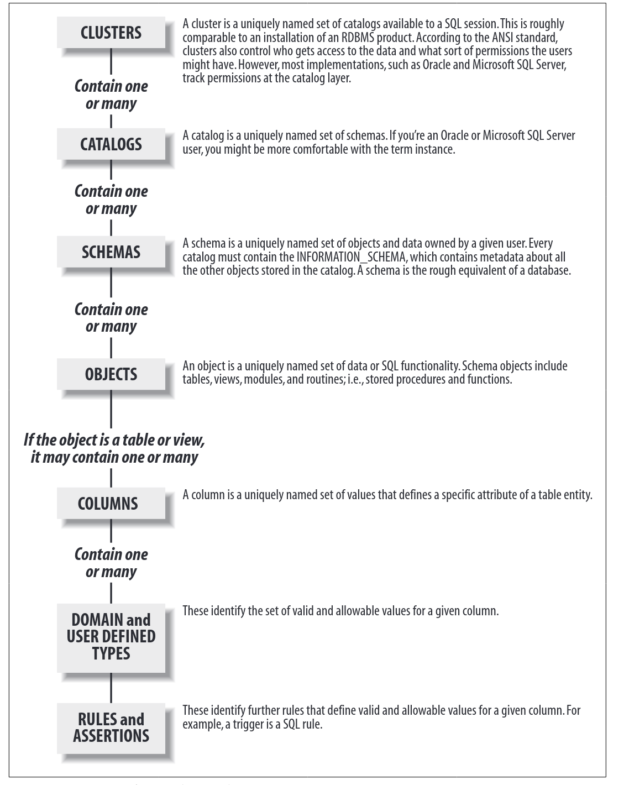

class: clear
```{r echo = FALSE, out.width="50%"}

```

Generally, each table will have a **key** column(s). The key column(s) could correspond to either a **primary** key, or a **unique** key or a **foreign** key.

Setting up and administrating a RDBMS is **outside** the scope of our class. We are generally only interested in **querying** from a RDBMS.

---
class: clear

For more on RDBMS, see 

+ The original [classic paper](https://www.seas.upenn.edu/~zives/03f/cis550/codd.pdf) by E. Codd. 

+ Chapter 15 and Chapter 16 of [Modern Data Science with R, 2nd edition](https://mdsr-book.github.io/mdsr2e/ch-sql2.html)

+ The lecture videos on [Youtube](https://www.youtube.com/watch?v=x8kMELlNaYg&list=PLroEs25KGvwzmvIxYHRhoGTz9w8LeXek0&index=5) from Stanford University.

+ The book [SQL in a nutshell](https://www.oreilly.com/library/view/sql-in-a/9780596155322/)

+ Any of the books listed [here](https://catalog.lib.ncsu.edu/catalog?q=relational+database&search_field=all_fields)

---
#SQL and R.

SQL stands for structured query language and is a data manipulation language designed for working with RDBMS. 

There are several approaches for using SQL with R. See this [R Studio vignette](https://db.rstudio.com/getting-started/database-queries/) for a quick introduction.

Three simple approaches are 

+ Through the [dbplyr](https://dbplyr.tidyverse.org/) backend to **dplyr**.

+ Through the R Database interface provided by the [DBI](https://cran.r-project.org/web/packages/DBI/index.html) library.

+ `SQL` chunk inside your Rmarkdown documents.

---
# dbplyr: A quick example

```{r chunk1, cache = TRUE}
library(mdsr)
library(RMySQL)
library(dbplyr)
library(dplyr)
## This creates a connection to a SQL server at Smith College
## This SQL server was created to accompany the book Modern Data Science with R.
db <- dbConnect_scidb(dbname = "airlines") 
class(db)
dbListTables(db)
```

---
class: clear
```{r chunk2, dependson="chunk1", cache = TRUE}
tables <- c("flights", "planes", "airports", "carriers")
##dbGetQuery sends SQL Select Queries to the SQL server
nrow.tables <- map_int(tables, function(x) 
  as.integer(db %>% dbGetQuery(paste0("SELECT COUNT(*) FROM ", x))))
names(nrow.tables) <- tables
nrow.tables
```

---
class: clear
```{r chunk3, dependson="chunk2", cache = TRUE}
flights_db <- db %>% tbl("flights")
flights_db
```

---
class: clear

This could take a WHILEEEEEEEEE......

```{r chunk4, dependson="chunk3", cache = TRUE}
tailnum_delay_db <- flights_db %>% 
  group_by(tailnum) %>%
  summarise(
    delay = mean(arr_delay),
    n = n()
  ) %>% 
  filter(n > 100)
tailnum_delay_db %>% head()
```
---
class: clear
```{r chunk5, dependson="chunk4", cache = TRUE}
## This allows us to automatically translate a query in dplyr into SQL syntax.
tailnum_delay_db %>% show_query()
```

---
class: clear

If you want to collect the results, use [collect](https://dplyr.tidyverse.org/reference/compute.html).

```{r chunk6, dependson="chunk5", cache = TRUE}
tailnum_delay <- tailnum_delay_db %>% collect()
glimpse(tailnum_delay)
```

---
class: clear

Finally, note that your queries to the database are **lazily evaluated** and can thus be augmented, provided that you had not collect the results.

```{r chunk7, dependson="chunk6", cache = TRUE}
db <- dbConnect_scidb(dbname = "airlines") 
tailnum_db2 <- tailnum_delay_db %>% mutate(total_delay = delay*n)
tailnum_db2 %>% show_query()
tailnum_db2 %>% head()
```

---
class: clear
```{r chunks8, dependson="chunk7", cache = TRUE, error = TRUE}
tailnum_delay %>% show_query()
tailnum_delay %>% mutate(total_delay = delay*n) %>% head()
```

---
# Sqlite

If you want to learn more about SQL and the use of RDBMS, it is easiest to start with creating and using a [sqlite](https://www.sqlite.org/index.html) database.

```{r sqlitechunk1, cache = TRUE}
library(RSQLite)
library(DBI)
con_sqlite <- dbConnect(RSQLite::SQLite(),"tmp_sqlite")
dbListTables(con_sqlite)
dbDisconnect(con_sqlite)
```

The above code chunk creates a SQLite database. This database is stored inside the file `tmp_sqlite` on your disk/storage system.

---
class: clear

Let us now add some data to our database.
```{r sqlitechunk2, dependson="sqlitechunk1", cache = TRUE}
con_sqlite <- dbConnect(RSQLite::SQLite(),"tmp_sqlite")
dbWriteTable(con_sqlite, "mtcars", mtcars)
dbListTables(con_sqlite)
library(nycflights13)
dbWriteTable(con_sqlite, "flights", flights)
dbWriteTable(con_sqlite, "airlines", airlines)
dbWriteTable(con_sqlite, "airports", airports)
dbListTables(con_sqlite)
dbDisconnect(con_sqlite)
```

---
class: clear

Let us now query data from this database.
```{r}
library(DBI)
library(RSQLite)
library(dplyr)
con_sqlite <- dbConnect(RSQLite::SQLite(),"tmp_sqlite")
flights <- con_sqlite %>% tbl("flights")
flights
```

---
class: clear
```{r}
library(dplyr)
airports <- con_sqlite %>% tbl("airports")
airports
```
---
class: clear
```{r}
query1 <- flights %>% group_by(dest) %>% summarize(count = n()) %>% 
  slice_max(count, n = 20) %>%
  left_join(airports, by = c("dest" = "faa"))
query1
```

---
class: clear

```{r}
query1 %>% show_query()
pop_dest <- query1 %>% collect()
glimpse(pop_dest)
```

---
class: clear
As we saw, most operations that we can do using **dplyr** on normal data frames, we can also do on tables contained in a database. Here our tables are stored in a SQLite database but even when our tables are stored in an Oracle or MySQL or Postgresql database our code will generally not change.

Finally, if we want, we can send SQL code directly to the database through [DBI::dbGetQuery](https://dbi.r-dbi.org/reference/dbgetquery).

```{r}
query2a <- con_sqlite %>% dbGetQuery('SELECT
  COUNT(*) as numFlights,
  SUM(IIF(arr_delay < 15, 1.0, 0.0))/count(*) as ontimePct,
  SUM(IIF(arr_delay < 0, 1.0, 0.0))/count(*) as earlyPct,
  SUM(arr_delay) / 1e6 as netMinLate,
  SUM(IIF(arr_delay > 0, arr_delay, 0)) / 1e6 as minLate,
  SUM(IIF(arr_delay < 0, arr_delay, 0)) / 1e6 as minEarly
FROM "flights" as o
WHERE year = 2013
LIMIT 0, 6;')
query2a
```


---
class: clear

The same code, when written using **dplyr** and **dbplyr** is quite similar.

```{r}
query2b <- flights %>% summarize(
  numFlights = n(), 
  ontimePct = sum(if_else(arr_delay < 15, 1, 0))/n(),
  earlyPct = sum(if_else(arr_delay < 0, 1, 0))/n(),
  netMinLate = sum(arr_delay)/10^6,
  minLate = sum(arr_delay[arr_delay > 0])/10^6,
  minEarly = sum(arr_delay[arr_delay <0])/10^6
)
query2b
```

---
class: clear

This code however doesn't seem to work as expected.

```{r}
query2c <- con_sqlite %>% dbGetQuery('SELECT
  COUNT(*) as numFlights,
  SUM(IIF(arr_delay < 15, 1, 0))/count(*) as ontimePct,
  SUM(IIF(arr_delay < 0, 1, 0))/count(*) as earlyPct,
  SUM(arr_delay) / 1e6 as netMinLate,
  SUM(IIF(arr_delay > 0, arr_delay, 0)) / 1e6 as minLate,
  SUM(IIF(arr_delay < 0, arr_delay, 0)) / 1e6 as minEarly
FROM "flights" as o
WHERE year = 2013
LIMIT 0, 6;')
query2c
```

---
class: clear

```{r}
sapply(query2c, typeof)
sapply(query2a, typeof)
```

--

Beware of integers division!
