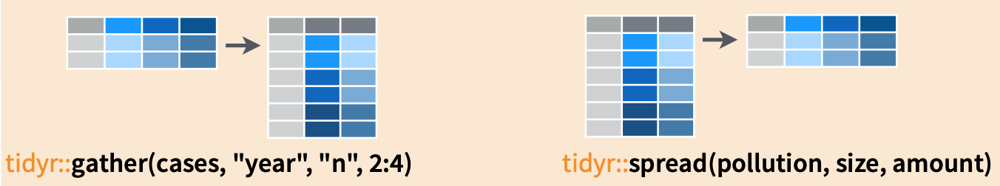

class: clear
.pull-left[
```{r echo = FALSE}
knitr::kable(table3, caption = "Table 3") %>% 
  kable_styling(bootstrap_options = "striped", font_size = 14)

```
]
.pull-right[
```{r echo = FALSE}
knitr::kable(table4a, caption = "Table 4a") %>% 
  kable_styling(bootstrap_options = "striped", font_size = 14)
knitr::kable(table4b, caption = "Table 4b") %>% 
  kable_styling(bootstrap_options = "striped", font_size = 14)
```
]

<br>
<br> 
The above tables, while representing the same data, are not equally easy to use. 
For example, table $4a$ provides the simplest way for finding the difference in the number of cases between $1999$ and $2000$. Table $1$ is the easiest table to add new variables such as $\mathrm{GDP}$. Table $3$ is not particularly suitable for data analysis, but is possibly useful for data collection. Table $2$ is appropriate if the columns of Table $1$, instead of being *cases* and *populations*, are e.g., *diabetes*, *HIV*, *colon cancer*, ... for which there is possibly missing/unobserved data (that is not all diseases are surveyed for every country). 
---
#gather() and spread()
There is often a need to transform data between two different representations exemplified by Table $1$ and Table $2$ in the previous slide. The main tool for doing so are the verbs **gather** and **spread** that are part of the **tidyr** library.  For a thoughtful discussion of the motivations behind **tidyr**, see the article [Tidy Data](https://www.jstatsoft.org/article/view/v059i10) by Hadley Wickham. 

To convert from Table $1$ to Table $2$, we do
```{r eval = FALSE}
table2 <- gather(table1, key = "type", value = "value", cases, population)
```

Conversely, to convert from Table $2$ to Table $1$, we do
```{r eval = FALSE}
table1 <- spread(table2, type, value)
```

---
class: clear
The idea behind *gather* and *spread* is best described by the following graphic; in particular, *gather* makes "wide" data "longer" while *spread* makes "long" data "wider".

```{r echo = FALSE}

```

---
class: clear
As another example, consider the following two representations of table $4a$.
```{r}
table4a %>% gather(key = "year", value = "cases", `1999`, `2000`) %>% 
  arrange(country, year)
table4a %>% gather(key = "year", value = "cases", `1999`, `2000`) %>% 
  spread(year, cases)
```
